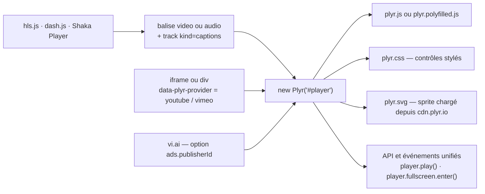

# sampotts/plyr

> **Un lecteur média HTML5, YouTube et Vimeo à habiller soi-même, pour un site web classique.**

## Le problème

Les contrôles natifs de `<video>` et `<audio>` ne se stylent pas et diffèrent d'un navigateur
à l'autre ; YouTube et Vimeo imposent chacun leur iframe, leur API et leurs événements. Sans
couche commune, on réécrit trois intégrations et on perd l'accessibilité au passage.

## Ce que ça fait vraiment

Plyr remplace les contrôles par du HTML « propre » — `<input type="range">` pour le volume,
`<progress>` pour la progression, de vrais `<button>` — que l'on style en CSS, sans balises
factices ni `<a href="#">` détournés.

Il enrichit le balisage existant par amélioration progressive : un `<video>`, un `<audio>`, ou
un `<iframe>` YouTube/Vimeo (voire un `<div>` portant `data-plyr-provider` et
`data-plyr-embed-id`) devient un lecteur après `new Plyr('#player')`.

Il unifie l'API et les événements : les mêmes méthodes (`player.play()`,
`player.fullscreen.enter()`), setters et getters valent pour les trois sources, ce qui évite de
manipuler directement les API Vimeo et YouTube.

Il gère les sous-titres VTT et les lecteurs d'écran, les vignettes de prévisualisation
(`previewThumbnails`, VTT à générer soi-même), le plein écran, le responsive, et un mode
publicitaire optionnel branché sur vi.ai.

Il ne décode pas les flux lui-même : la lecture en streaming passe par hls.js, dash.js ou Shaka
Player, pour lesquels le README fournit des exemples d'intégration.

## Comment c'est branché

Aucun diagramme tiré du code n'existe pour ce dépôt ; le schéma ci-dessous est reconstruit
depuis le seul README.



## Essayer

```bash
# Le README ne documente aucune commande d'installation du paquet ;
# la seule commande donnée est la construction depuis les sources.
npm i && npm run build
```

Le chemin documenté sans ligne de commande est le module ES `import Plyr from 'plyr';` puis
`const player = new Plyr('#player');`, ou les fichiers pré-construits du CDN :

```html
<script src="https://cdn.plyr.io/3.8.4/plyr.js"></script>
<link rel="stylesheet" href="https://cdn.plyr.io/3.8.4/plyr.css" />
```

## Coût et pièges

- **Gratuit, licence MIT**, aucune clé d'API ni compte requis pour le lecteur lui-même.
- **Dépendance CDN par défaut** : le sprite SVG est « chargé automatiquement » depuis
  `cdn.plyr.io` (Cloudflare). C'est un tiers dans le chemin de rendu de chaque page ; le README
  indique qu'on peut changer cela par les options, ou auto-héberger les fichiers (téléchargement
  depuis le CDN ou unpkg, ou `npm i && npm run build` vers `dist`).
- **Polyfills à ta charge** : Plyr est écrit en ES6 et le projet assume de ne pas embarquer les
  polyfills ; IE10/IE11 en exigent. Une variante `plyr.polyfilled.js` existe.
- **iPhone** : Safari mobile force le lecteur natif pour `<video>` sans l'attribut
  `playsinline`, et les contrôles de volume y sont désactivés au niveau de l'appareil.
- **Poster** : à passer par `data-poster` et non `poster`, sinon l'image est téléchargée deux fois.
- **Monétisation** : les publicités supposent un compte vi.ai et un `publisherId` ; le README
  renvoie les questions de facturation à vi.ai, pas au projet.
- **Vignettes de prévisualisation** : les fichiers VTT et les images sont à générer soi-même.

## Ce que ce n'est pas

- **Ce n'est pas un projet à démarrer aujourd'hui.** L'encart en tête du README annonce que les
  équipes de Plyr, Vidstack et Media Chrome ont fusionné dans la nouvelle version de Video.js et
  que « Plyr will soon be deprecated ». C'est le fait dominant de cette fiche.
- **Ce n'est pas un moteur de lecture** : pas de décodage, pas de HLS ni de DASH en propre. Le
  streaming vient de hls.js, dash.js ou Shaka ; Plyr n'est que l'habillage et l'API au-dessus.
- **Ce n'est pas un hébergeur vidéo** ni un transcodeur : le README renvoie explicitement à Mux
  pour l'hébergement. Les composants React, Vue, Angular, Svelte et les plugins CMS sont tenus
  par des tiers, pas par le dépôt.

## Alternatives

| | Quand le préférer |
|---|---|
| **videojs/video.js** | Recommandé par le README lui-même comme successeur : la version qui absorbe Plyr, Vidstack et Media Chrome. À préférer pour tout nouveau développement ; ne rester sur Plyr que pour une base existante qui fonctionne. |
| **paypal/accessible-html5-video-player** | Cité dans les crédits comme l'origine dont Plyr a été porté. Pertinent seulement si l'on cherche un lecteur accessible minimal, sans YouTube ni Vimeo. |

Les intégrations nommées dans le README (hls.js, dash.js, Shaka Player) ne sont pas des
alternatives mais des compléments : elles fournissent le flux que Plyr habille.

## Pour toi

Peu de rapport avec la data ou le MLOps, sauf sur un point pratique : publier des vidéos de
démonstration, des captures d'expériences ou des enregistrements d'entretiens sur une page de
projet ou une documentation, avec des sous-titres et un lecteur identique partout. Dans ce cas
précis, aller directement à Video.js, puisque le dépôt annonce lui-même sa fin.
