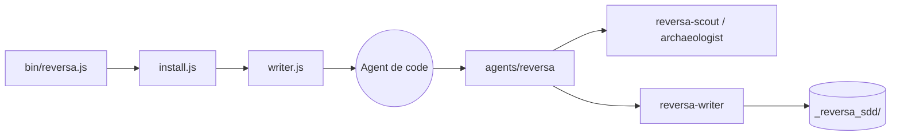

# sandeco/reversa

> Cadre d'agents qui extrait d'un code legacy des spécifications exploitables par d'autres agents de code.

## Le problème
Un système legacy porte des règles métier implicites et des décisions jamais écrites ; sans spec, un agent de code ne sait pas ce qu'il ne doit pas casser.

## Ce que ça fait vraiment
`npx reversa install` détecte les agents présents (Claude Code, Codex, Cursor…), copie des skills dans `.agents/skills/` et crée `.reversa/` (état, config, plan, manifeste SHA-256).
`/reversa` enchaîne Scout (surface), Archaeologist (modules), Detective (règles, ADR rétroactives), Architect (C4, ERD), Writer, puis Reviewer ; pause `CONTINUAR` entre agents, reprise via `.reversa/state.json`.
Sortie dans `_reversa_sdd/` : inventaire, dictionnaire de données, machines à états, specs par composant, matrices de traçabilité.
Autres équipes : évolution (`/reversa-forward`), migration, mini-site HTML, bugs, refactor, chiffrage.

## Comment c'est branché


## Essayer
```bash
npx reversa install
# puis, dans l'agent :
# /reversa
```

## Coût et pièges
Reversa ne demande aucune clé : tout passe par l'agent déjà installé, donc par son abonnement ou sa clé. Le coût d'une analyse complète n'est pas chiffré dans le README. Node.js 18+.

## Ce que ce n'est pas
Pas sans risque : l'installeur ne modifie pas tes fichiers et les écritures des agents sont limitées par consigne à `.reversa/` et `_reversa_sdd/`, mais le README exige commit et sauvegarde, un agent pouvant se tromper.
Pas une doc pour humains : des contrats destinés aux agents.
Commandes et artefacts en partie en portugais (`CONTINUAR`, `expresso`).

## Alternatives
Aucune alternative nommée dans le README.

## Pour toi
Utile pour documenter un vieux code avant de le confier à un agent ; teste d'abord sur un petit module.
