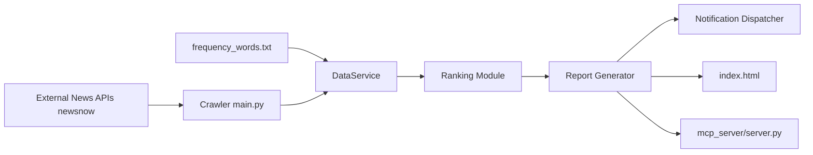

# sansan0/TrendRadar

> Agrégateur chinois de sujets tendance filtrés par mots-clés, avec notifications et serveur MCP d'analyse.

## Le problème
Suivre l'actualité sur une dizaine de plateformes chinoises noie l'utilisateur sous des sujets sans rapport avec ce qui l'intéresse.

## Ce que ça fait vraiment
D'après l'architecture fournie (générique mais citant les fichiers) : `main.py` récupère les sujets chauds via l'API du projet newsnow, filtre selon `frequency_words.txt` (mots obligatoires, exclusions), classe par poids (rang, fréquence, popularité), génère des rapports HTML/texte dans `output/` et notifie (WeChat, Feishu, DingTalk, Telegram, e-mail, ntfy).
Trois modes de diffusion : quotidien, courant, incrémental. Un serveur MCP (`mcp_server/server.py`) expose des outils d'analyse (tendances, sentiment, comparaison entre plateformes) aux clients IA. Exécution par GitHub Actions après fork, ou Docker.

## Comment c'est branché

## Essayer
Aucune commande dans la partie lue du README, occupée par remerciements et dons.

## Coût et pièges
Gratuit, GPL-3.0. Toutes les données viennent de l'API newsnow, offerte par la bienveillance de son auteur : le README demande de limiter la fréquence des requêtes.

## Ce que ce n'est pas
Pas un outil de veille générique : les sources sont des plateformes chinoises. La partie lue du README ne documente pas l'outil lui-même.

## Alternatives
Aucune alternative nommée dans le README (newsnow est la source de données, pas un concurrent).

## Pour toi
À ignorer : sources hors périmètre ; seul le serveur MCP d'analyse de tendances mérite un coup d'œil.
