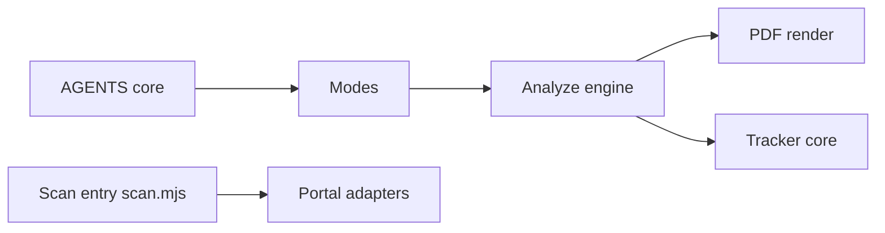

# santifer/career-ops

> Pipeline de recherche d'emploi piloté par un CLI d'agent : évalue les offres, adapte le CV, suit les candidatures.

## Le problème
Suivre des dizaines d'offres, adapter son CV à chacune et garder un historique est long et dispersé.

## Ce que ça fait vraiment
Des modes en Markdown pour l'agent évaluent une offre sur une grille A–H, génèrent CV et lettre en PDF (Playwright), scannent des portails d'emploi et tiennent un suivi local. Un tableau de bord en Go, un mode batch. Il ne postule jamais à ta place.

## Comment c'est branché


## Essayer
```bash
npx @santifer/career-ops init
cd career-ops
claude
npm run doctor
```

## Coût et pièges
Consomme des tokens ; une clé `ANTHROPIC_API_KEY` dans l'environnement passe avant l'abonnement. Ton CV part chez le fournisseur choisi.

## Ce que ce n'est pas
Pas un outil de candidature automatique. Les évaluations sont des recommandations, l'IA peut inventer des compétences. La licence n'est pas déclarée dans le catalogue (le README dit MIT).

## Alternatives
Aucune alternative nommée dans le README.

## Pour toi
À ignorer pour l'usage data/MLOps : c'est un outil perso de recherche d'emploi, sans rapport avec ton travail technique.
