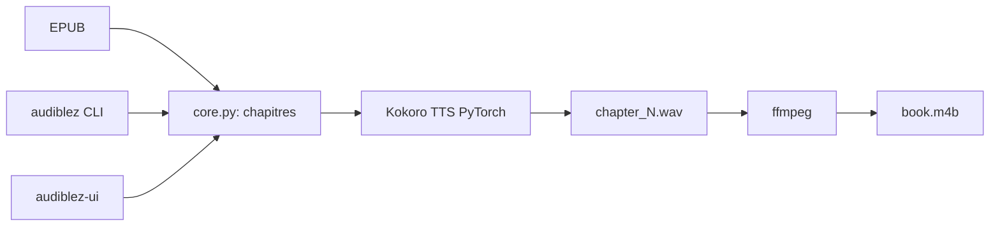

# santinic/audiblez

> Convertit un livre EPUB en livre audio M4B avec synthèse vocale locale, en ligne de commande ou en interface.

## Le problème
Écouter un ebook demande de trouver ou de payer un livre audio, ou d'en produire un soi-même chapitre par chapitre.

## Ce que ça fait vraiment
Lit l'EPUB, identifie les chapitres (sélection interactive avec `--pick`), génère un fichier WAV par chapitre avec un modèle TTS Kokoro-82M, puis fusionne le tout en `.m4b` avec ffmpeg. Le choix de voix, la vitesse de 0,5 à 2,0 et l'option `--cuda` sont disponibles. Une interface wxPython existe (`audiblez-ui`). D'après l'architecture décrite d'après le code, CLI et GUI partagent `core.py`.

## Comment c'est branché


## Essayer
```bash
sudo apt install ffmpeg espeak-ng
pip install audiblez
audiblez book.epub -v af_sky
audiblez book.epub -v af_sky -s 1.5
audiblez-ui
```

## Coût et pièges
Gratuit. Il faut `espeak-ng` et `ffmpeg`, sans quoi le `.m4b` n'est pas produit. Pas de prise en charge d'Apple Silicon pour l'instant. Sur Windows, le README recommande un venv.

## Ce que ce n'est pas
Ce n'est pas une voix clonée ni un service en ligne : tout tourne en local, mais le rendu dépend de la qualité de Kokoro.

## Alternatives
Aucune alternative nommée dans le README.

## Pour toi
Surveiller : exemple concret de TTS local à essayer si tu veux des livres audio, mais outil étroit, maintenu par une seule personne et sans support Apple Silicon.

