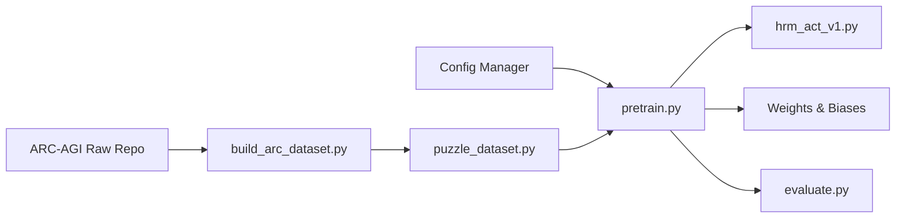

# sapientinc/HRM

> Code de recherche du Hierarchical Reasoning Model, petit réseau récurrent pour puzzles de raisonnement.

## Le problème
Les LLM raisonnent par chaîne de pensée, coûteuse en données et en latence, et peinent sur Sudoku difficiles, labyrinthes ou ARC.

## Ce que ça fait vraiment
Implémente HRM (27 M de paramètres) : un module haut niveau lent de planification et un module bas niveau rapide, en une seule passe.
Scripts de construction de jeux (ARC-1/2, Sudoku, Maze), entraînement `pretrain.py`, évaluation `evaluate.py` et notebook `arc_eval.ipynb`.
Checkpoints fournis pour ARC-AGI-2, Sudoku et Maze ; visualiseur HTML des puzzles.
Suivi des expériences obligatoire sur Weights & Biases.

## Comment c'est branché


## Essayer
```bash
pip install -r requirements.txt
wandb login
python dataset/build_sudoku_dataset.py --output-dir data/sudoku-extreme-1k-aug-1000  --subsample-size 1000 --num-aug 1000
OMP_NUM_THREADS=8 python pretrain.py data_path=data/sudoku-extreme-1k-aug-1000 epochs=20000 eval_interval=2000 global_batch_size=384 lr=7e-5 puzzle_emb_lr=7e-5 weight_decay=1.0 puzzle_emb_weight_decay=1.0
```

## Coût et pièges
GPU CUDA indispensable, extensions CUDA et FlashAttention à compiler ; ~10 h sur RTX 4070 portable pour la démo.
Expériences complètes sur 8 GPU ; compte W&B requis.

## Ce que ce n'est pas
Pas un LLM ni un modèle généraliste : il s'entraîne par tâche de puzzle.
Variance de ±2 points et instabilité en fin d'entraînement signalées.

## Alternatives
Aucune alternative nommée dans le README.

## Pour toi
À surveiller pour la veille recherche sur le raisonnement compact ; rien à brancher dans un pipeline data/MLOps aujourd'hui.
