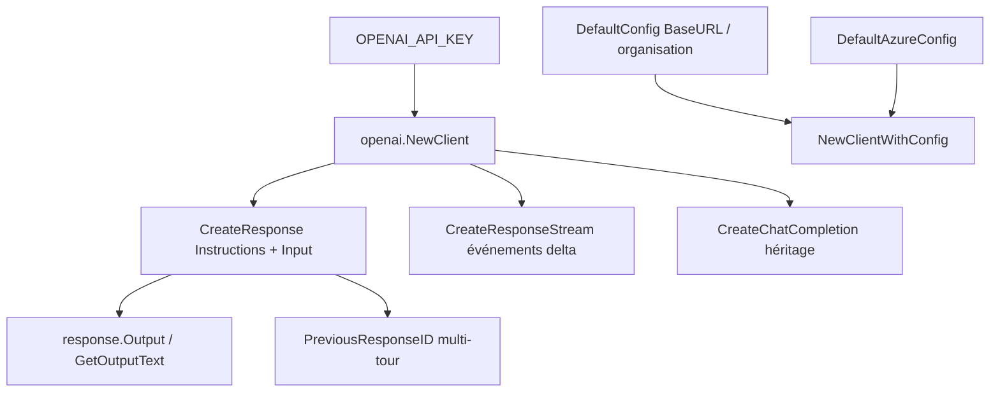

# sashabaranov/go-openai

> Client Go non officiel de l'API OpenAI, centré sur l'API Responses.

## Le problème
Appeler l'API OpenAI depuis Go demande sinon de construire soi-même requêtes, types et gestion du streaming.
Le passage de Chat Completions à Responses change la forme des échanges, donc le code maison se périme.

## Ce que ça fait vraiment
Couvre l'API Responses (`CreateResponse`, `CreateResponseStream`, `GetOutputText`, `PreviousResponseID` pour l'état multi-tour) et garde Chat Completions pour l'existant.
Couvre aussi embeddings, images, audio, modération, fichiers, fine-tuning, batches, vector stores et les surfaces Assistants héritées.
Constantes de modèles par palier — `GPT5Dot6Sol`, `GPT5Dot6Terra`, `GPT5Dot6Luna`, alias `GPT5Dot6` — et acceptation d'identifiants en chaîne pour les modèles non encore constantés.
Configuration par `DefaultConfig` (client HTTP, `BaseURL`, organisation, en-têtes) ou `DefaultAzureConfig` pour Azure OpenAI ; erreurs inspectables via `errors.As` sur `*openai.APIError`.

## Comment c'est branché


## Essayer
```sh
go get github.com/sashabaranov/go-openai
export OPENAI_API_KEY="<your key>"
go run ./examples/responses
```

## Coût et pièges
La bibliothèque est gratuite ; chaque appel est facturé par OpenAI, sur votre clé.
Piège de coût signalé par le README : ne pas utiliser le modèle haut de gamme pour tout, choisir le palier Sol/Terra/Luna selon la charge. Il faut renvoyer `Instructions` à chaque appel pour qu'elles continuent de s'appliquer, et `Store` doit être mis pour chaîner par `PreviousResponseID`.

## Ce que ce n'est pas
Pas officiel : le README l'annonce comme client non officiel.
Pas un cadre d'agents : pas de boucle d'outils fournie, seulement les appels API.
Pas limité à OpenAI en pratique, puisque `BaseURL` accepte un point de terminaison compatible — sans garantie de compatibilité.

## Alternatives
Aucune alternative nommée dans le README.

## Pour toi
À connaître si tu écris du Go ; côté Python, les SDK officiels restent la voie directe.
