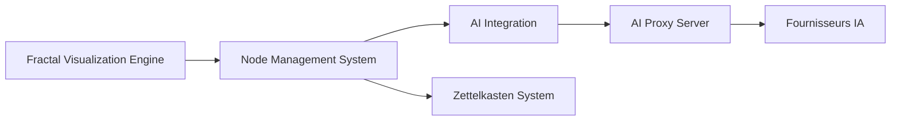

# satellitecomponent/Neurite

> Espace de travail web de cartes mentales sur fond fractal, avec nœuds IA et mémoire Zettelkasten.

## Le problème
Organiser des idées et des conversations avec des IA dans une interface linéaire fait perdre les liens entre elles.

## Ce que ça fait vraiment
Interface web où l'on navigue dans l'ensemble de Mandelbrot et où l'on place des nœuds : texte, image, vidéo, page web, PDF et agents IA connectés entre eux. Les nœuds sont physiquement simulés ; les nœuds IA échangent des messages et lisent le graphe connecté. Un Zettelkasten se synchronise avec la carte, avec base vectorielle locale. Fournisseurs : Ollama, transformers.js, OpenAI, Groq, Anthropic. Serveurs locaux pour proxy, scraping, Wikipedia, Wolfram Alpha.

## Comment c'est branché


## Essayer
Aucune commande n'est donnée dans le README ; le projet renvoie à un site et à une version Desktop.
```bash
# aucune commande documentée dans le README
```

## Coût et pièges
Le code est gratuit, les modèles cloud demandent leurs clés. Version Desktop expérimentale : macOS non signé, avertissement sur Windows. Avertissement du README sur les lumières clignotantes.

## Ce que ce n'est pas
Pas un outil de productivité éprouvé : interface expérimentale, « Neural API » en essai. Les liens de sécurité entre nœuds et serveurs locaux ne sont pas décrits.

## Alternatives
- Aucune alternative nommée dans le README.

## Pour toi
Ignorer : curiosité graphique sans usage clair pour un flux data/MLOps.
