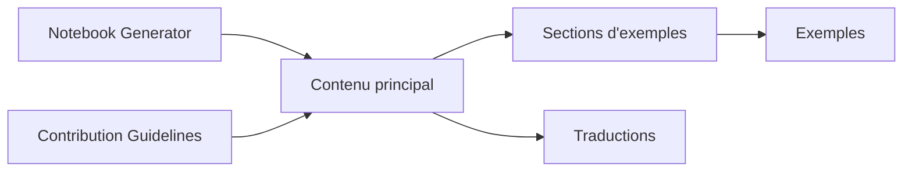

# satwikkansal/wtfpython

> Collection d'exemples Python déroutants, expliqués, pour progresser sur les rouages du langage.

## Le problème
Certains comportements de Python surprennent même les habitués (identité d'objets, portée, mutabilité) et causent des bogues difficiles à comprendre.

## Ce que ça fait vraiment
Chaque exemple suit le même gabarit : code d'amorce, sortie inattendue, puis explication. Sections : « Strain your brain », « Slippery Slopes », « The Hidden treasures », « Appearances are deceptive », « Miscellaneous ». Des traductions existent, ainsi qu'un site interactif et un carnet Jupyter. Les exemples sont testés sur Python 3.5.2, avec des versions précisées quand le résultat diffère.

## Comment c'est branché


## Essayer
```bash
# Aucune commande d'installation dans le README : lire les exemples dans l'ordre.
# Exemple montré :
# >>> a, b = 257, 257
# >>> a is b
```

## Coût et pièges
Gratuit. Certains résultats varient selon la version de Python ou le mode interactif ; le dépôt le précise cas par cas.

## Ce que ce n'est pas
Pas un manuel de bonnes pratiques ni un cours structuré ; certains exemples sont périmés (Python 2, moins de 3.7), et le README le signale.

## Alternatives
Aucune alternative nommée dans le README.

## Pour toi
À adopter : une heure de lecture évite des bogues subtils (arguments mutables, fermetures en boucle, `is` contre `==`) dans du code de pipelines Python.

