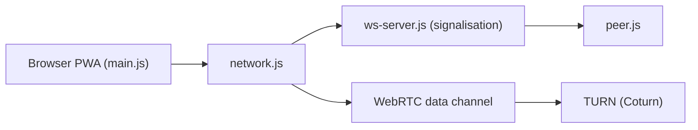

# schlagmichdoch/PairDrop

> Partage de fichiers en pair-à-pair dans le navigateur, façon AirDrop, sur réseau local ou Internet.

## Le problème
Envoyer un fichier d'un téléphone à un ordinateur sans compte ni câble.

## Ce que ça fait vraiment
Une appli web (PWA) trouve les appareils du même réseau, d'une salle publique temporaire ou appairés par code. Les fichiers passent en WebRTC ; le serveur Node ne fait que la signalisation par WebSocket. Un serveur TURN (Coturn) peut aider hors réseau local.

## Comment c'est branché

## Essayer
Aucune commande dans le README ; auto-hébergement avec Docker ou Node.js décrit dans la FAQ.

## Coût et pièges
Gratuit. Le passage hors réseau local peut demander un serveur TURN à déployer. Dernier push le 2026-04-22.

## Ce que ce n'est pas
Pas un stockage ni un service de sauvegarde : rien n'est conservé côté serveur. Licence GPL-3.0.

## Alternatives
Snapdrop, dont PairDrop est un fork, est cité par le README.

## Pour toi
Ignorer : outil de partage de fichiers personnel, sans utilité pour un pipeline data/IA.

