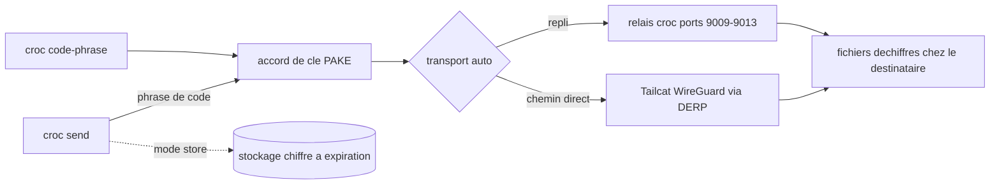

# schollz/croc

> **Encrypted file transfer between any two machines, driven by a word code, with no server to run.**

## The problem

Moving a folder from one machine to another normally means a cloud account, a network share, an
open port, or an SSH key exchanged beforehand. Between two hosts behind different NATs — a lab
box and a laptop, a training server and a workstation — there is often no direct path at all,
and no way to resume after the link drops.

## What it actually does

`croc send` prints a code phrase; typing that phrase on the other machine starts the transfer.
The code drives a password-authenticated key agreement (PAKE) that yields the end-to-end
encryption key. The default `--transport auto` builds a Tailcat/WireGuard path that starts over
DERP and is promoted to direct UDP when NAT traversal works, falling back to croc's own relay
data ports for browsers, older clients, or failed setup. The README also documents multiple
files, resumable transfers, IPv6-first with IPv4 fallback, SOCKS5 proxying including Tor, stdin
and stdout pipes, QR codes, text sending, and path exclusion. Two side modes exist: `croc store`
uploads client-side encrypted ciphertext with an expiry and a download limit, and `croc ssh`
opens a shared terminal with separate read/write and read-only invitations. A browser client at
getcroc.com interoperates with the CLI.

## How it is wired



The diagram comes from the README alone; no code-derived diagram exists for this repository.
The code phrase is the hinge: it authenticates the PAKE and, for default public transfers, its
SHA-256 modulo the three-relay pool selects which deployment both peers use. A self-hosted
`croc relay`, or the Docker image, replaces that pool.

## Trying it

```bash
curl https://getcroc.com | bash
croc send [file(s)-or-folder]
croc code-phrase
```

On Linux and macOS the README advises passing the secret through the environment so it does not
leak via the process list (CVE-2023-43621):

```bash
CROC_SECRET=*** croc
```

Other documented installs include `brew install croc`, `scoop install croc`,
`choco install croc`, `apk add croc`, `pacman -S croc`, `pkg install croc`,
`conda install --channel conda-forge croc`, and from source with
`go install github.com/schollz/croc/v11@latest` (Go 1.27+).

## Cost and traps

Nothing to pay, no account to create, no prerequisite beyond the binary. The traps are elsewhere.
By default traffic goes through the project's public relays `1..4.getcroc.com`: content stays
end-to-end encrypted, but availability depends on that third-party service, and the README notes
that public DERP is best effort with possible fairness limits. In `store` mode the browser link
carries the decryption key after the `#`, so whoever holds the full link can decrypt the files.
On Unix a secret given as an argument leaks through the process list, hence `CROC_SECRET`. The
CLI checks for a new release in the background at most once every 24 hours, and the README opens
with a sponsorship appeal and sponsor banners — the project's funding is not settled.

## What it is not

Not a sync tool and not durable storage: a transfer lasts a session, and even `store` expires
(one day and one download by default). Not an SSH daemon: `croc ssh` exposes no account, public
IP, or inbound port, and disables remote commands, forwarding, and SFTP. Not an anonymity tool
either — encryption protects the payload, not the fact that two peers met on a known relay. The
mobile and desktop apps listed are unofficial community projects.

## Alternatives

- **magic-wormhole**, credited in the README as the original idea (via @warner): same word-code
  principle; croc differs with a single Go binary, resumable transfers, and a self-hostable relay.
- The community GUIs named in the README — Croc GUI, croc-desktop, FlCroc, croc-app — wrap croc
  rather than replace it; pick one if drag-and-drop matters.
- Among the supplied neighbours (avelino/awesome-go, JanDeDobbeleer/oh-my-posh, samber/lo,
  google/wire) there is no comparable alternative in the catalogue: they are unrelated Go projects.

## For you

Handy whenever a checkpoint, dataset, or dump has to leave a training machine for a local
workstation without a bucket or an open port — one binary on each side, one phrase, done. Skip
it for archiving or repeated distribution: it is not storage, and an automated pipeline really
wants a self-hosted relay first.
