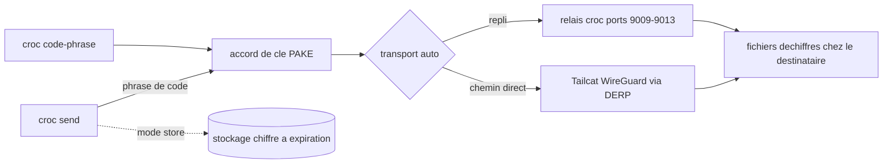

# schollz/croc

> **Transfert de fichiers chiffré entre deux machines, via un code de mots, sans serveur à monter.**

## Le problème

Envoyer un dossier d'une machine à une autre suppose d'ordinaire un compte cloud, un partage
réseau, un port ouvert ou une clé SSH échangée à l'avance. Entre deux postes derrière des NAT
différents — un labo et un poste perso, un serveur d'entraînement et un portable — il n'y a
souvent aucun chemin direct, et la reprise après coupure n'existe pas.

## Ce que ça fait vraiment

`croc send` affiche une phrase de code ; la même phrase tapée sur l'autre machine déclenche le
transfert. Le code sert de mot de passe pour un accord de clé authentifié par mot de passe
(PAKE), d'où sort la clé de chiffrement de bout en bout. Le transport par défaut (`--transport
auto`) tente un chemin direct WireGuard/Tailcat avec promotion UDP après démarrage via DERP, et
retombe sur les ports relais de croc si le pair est un navigateur, un client ancien, ou si la
mise en place échoue. Le README annonce aussi : plusieurs fichiers, reprise de transfert
interrompu, IPv6 d'abord avec repli IPv4, proxy SOCKS5 (Tor), pipes stdin/stdout, QR code,
envoi de texte, exclusion de chemins. Deux modes annexes : `croc store`, qui dépose des fichiers
chiffrés côté client sur un service de stockage à expiration et nombre de téléchargements
limités, et `croc ssh`, un terminal partagé à invitations lecture/écriture ou lecture seule.
Un client web sur getcroc.com est compatible avec la CLI.

## Comment c'est branché



Le schéma est déduit du README seul : aucun diagramme tiré du code n'est disponible pour ce
dépôt. La phrase de code est le pivot — elle authentifie le PAKE et, pour les transferts publics
par défaut, le SHA-256 du code modulo le pool de trois relais décide quel déploiement les deux
pairs utilisent. Un relai auto-hébergé (`croc relay`, ou l'image Docker) remplace ce pool.

## Essayer

```bash
curl https://getcroc.com | bash
croc send [file(s)-or-folder]
croc code-phrase
```

Sur Linux et macOS, le README recommande de passer le secret par l'environnement pour éviter
de le laisser dans la liste des processus (CVE-2023-43621) :

```bash
CROC_SECRET=*** croc
```

Autres installations documentées : `brew install croc`, `scoop install croc`,
`choco install croc`, `apk add croc`, `pacman -S croc`, `pkg install croc`,
`conda install --channel conda-forge croc`, ou depuis les sources avec
`go install github.com/schollz/croc/v11@latest` (Go 1.27+).

## Coût et pièges

Rien à payer, rien à créer comme compte, aucun prérequis autre que le binaire. Les pièges sont
ailleurs. Par défaut le trafic passe par les relais publics `1..4.getcroc.com` opérés par le
projet : le contenu est chiffré de bout en bout, mais la disponibilité dépend de ce service
tiers, et le README signale que le DERP public est « best effort » avec d'éventuelles limites
d'équité. Le mode `store` repose sur un service de stockage dont le lien contient la clé après
le `#` : quiconque a le lien complet déchiffre les fichiers. Sur Unix, le secret en argument
fuit par la liste des processus, d'où `CROC_SECRET`. La CLI vérifie une nouvelle version au plus
une fois par 24 h en tâche de fond — un appel réseau implicite, désactivable en pratique via
`--quiet` pour la notification. Le README ouvre sur un appel au sponsoring et affiche des
bannières de sponsors, signe que le financement du projet n'est pas acquis.

## Ce que ce n'est pas

Ce n'est pas une synchronisation ni un stockage durable : le transfert vit le temps d'une
session, et même `store` expire (un jour par défaut, un téléchargement par défaut). Ce n'est pas
un démon SSH : `croc ssh` n'expose ni compte, ni IP publique, ni port entrant, et désactive les
commandes distantes, le forwarding et SFTP. Ce n'est pas non plus un outil anonymisant — le
chiffrement protège le contenu, pas le fait que deux pairs se parlent via un relai connu. Les
applications mobiles et desktop listées sont des projets communautaires non officiels.

## Alternatives

- **magic-wormhole** (crédité dans le README comme l'idée d'origine, via @warner) : même
  principe de code de mots ; croc s'en distingue par un binaire Go unique, la reprise de
  transfert et le relai auto-hébergeable.
- Les GUI communautaires nommées dans le README — Croc GUI, croc-desktop, FlCroc, croc-app —
  ne remplacent pas croc, elles l'emballent ; à choisir si l'on veut du glisser-déposer.
- Parmi les voisins fournis (avelino/awesome-go, JanDeDobbeleer/oh-my-posh, samber/lo,
  google/wire), aucune alternative comparable dans le catalogue : ce sont des projets Go sans
  rapport avec le transfert de fichiers.

## Pour toi

Utile dès qu'il faut sortir un checkpoint, un jeu de données ou un dump d'une machine
d'entraînement vers un poste local sans monter de bucket ni ouvrir de port — un binaire des deux
côtés, une phrase, et c'est fait. À écarter pour de l'archivage ou de la distribution répétée :
ce n'est pas un stockage, et pour un flux automatisé un relai auto-hébergé est un prérequis.
