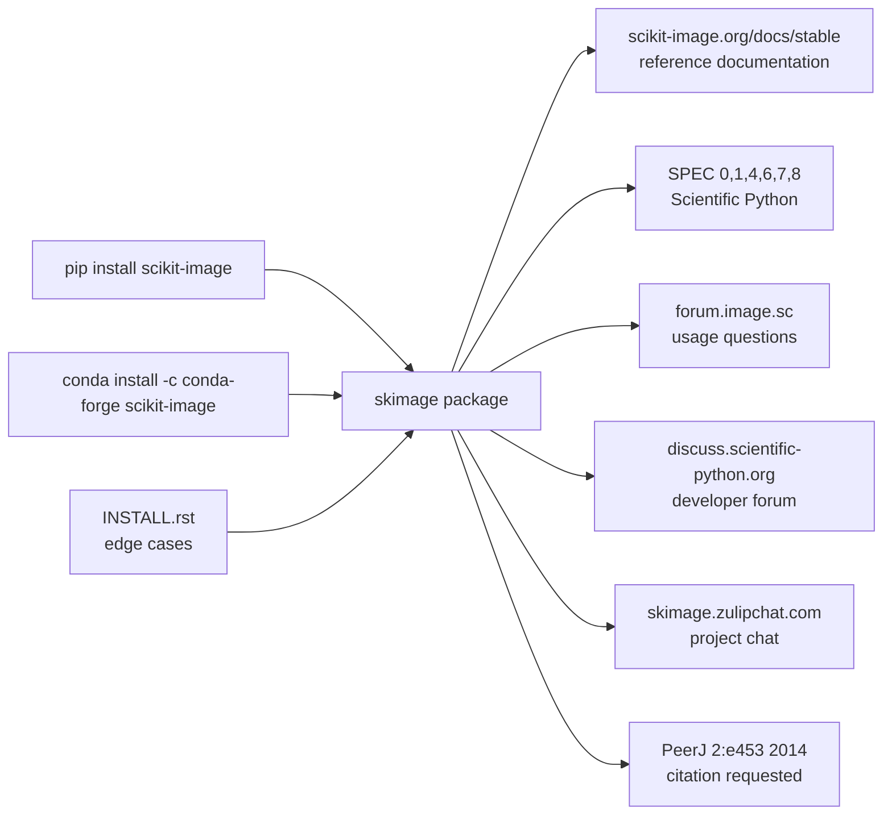

# scikit-image/scikit-image

> **The image-processing library of the scientific Python stack, for researchers and data engineers.**

## The problem

Without it, image work in Python means hand-rolling everything on raw NumPy arrays: filters,
thresholding, segmentation, region measurements rewritten project after project, with the border
and dtype bugs that come with it. The other route is dropping down to C libraries, at the cost of
a build chain and an API foreign to scientific Python conventions.

## What it actually does

This repository's README is deliberately minimal. It introduces itself in one line,
"scikit-image: Image processing in Python", and delegates everything else to the online
documentation. To be plain about it: **the functional content is not documented here** — no module
list, no code sample, no screenshot.

What the README does establish:

- The package installs via `pip` or via `conda` from the `conda-forge` channel, with a separate
  `INSTALL.rst` for edge cases.
- The project follows Scientific Python SPECs 0, 1, 4, 6, 7 and 8 — the ecosystem's shared
  conventions (support windows, naming, random generators), which says more about project
  discipline than any pitch would.
- Three separate community channels: the image.sc forum, a developer forum on
  discuss.scientific-python.org, and a Zulip chat — a collectively governed project, not a
  personal repository.
- An LFX (Linux Foundation Insights) health-score badge is displayed.
- An academic citation is requested: van der Walt *et al.*, PeerJ 2:e453 (2014).

## How it is wired

No code-derived diagram exists for this repository, and the README describes no architecture. The
graph below therefore stays within what the README asserts — install paths, documentation venues
and community channels. It does not claim to show `skimage`'s internal modules.



## Trying it

The README documents installation only — no usage command, no code snippet. The two lines it
gives, verbatim:

```bash
pip install scikit-image

conda install -c conda-forge scikit-image
```

For everything else (first example, gallery, tutorials) the README points to
`https://scikit-image.org/docs/stable/`, outside the scope of this sheet.

## Cost and gotchas

- **No money, no account, no API key, no third-party service**: it is an installable Python
  package, and the README describes no network call at runtime.
- **No GPU required or mentioned**: the README references no hardware acceleration.
- **Licence to verify**: the README merely links to `LICENSE.txt` without naming a licence, and the
  catalogue records `NOASSERTION` — GitHub could not identify it. Resolve it against the repository
  file before any closed-product use; that is the reason for the alert.
- **Moving Python support window**: following SPEC 0 means old Python and NumPy versions drop out
  of support on a rolling schedule. A long-frozen environment will eventually fall outside it.
- **Citation expected** for academic use — not a financial cost, but a real one when publishing.

## What it is not

- **Not a deep-learning computer-vision library.** The README mentions no model, no training, no
  inference: the stated domain is image processing, not learned object detection.
- **Not an application or a GUI**: there is nothing to launch; it is a package you import from your
  own code.
- **This README is not documentation.** It does not say what the package contains; the useful
  knowledge lives on the external site. Judging the project from this file alone would be a
  mistake — hence the `insufficient material` alert, which is about the README, not the project.

## Alternatives

| | When to prefer it |
|---|---|
| **kornia/kornia** | Differentiable image operations on PyTorch tensors, GPU included. Prefer it when the operations must sit inside a training graph or run on GPU; prefer scikit-image for scientific analysis on NumPy arrays, on CPU, outside learning. |
| **roboflow/supervision** | Tooling around object detection (boxes, masks, annotations, tracking). Prefer it when the starting point is an already-trained detector; scikit-image does not operate at that level. |

The other catalogue neighbours (`PennyLaneAI/pennylane`, `huggingface/lerobot`) are not comparable:
quantum computing and robotics, unrelated to image processing.

## For you

Adopt it without hesitation, on the same footing as NumPy or SciPy: it is the default brick as soon
as a data pipeline touches images before the model step — cleaning, thresholding, segmentation,
measurement extraction, training-set preparation. Community governance, SPEC compliance and long
history make it a low-risk dependency; the only item to settle before closed-product use is
checking the licence in `LICENSE.txt`.
