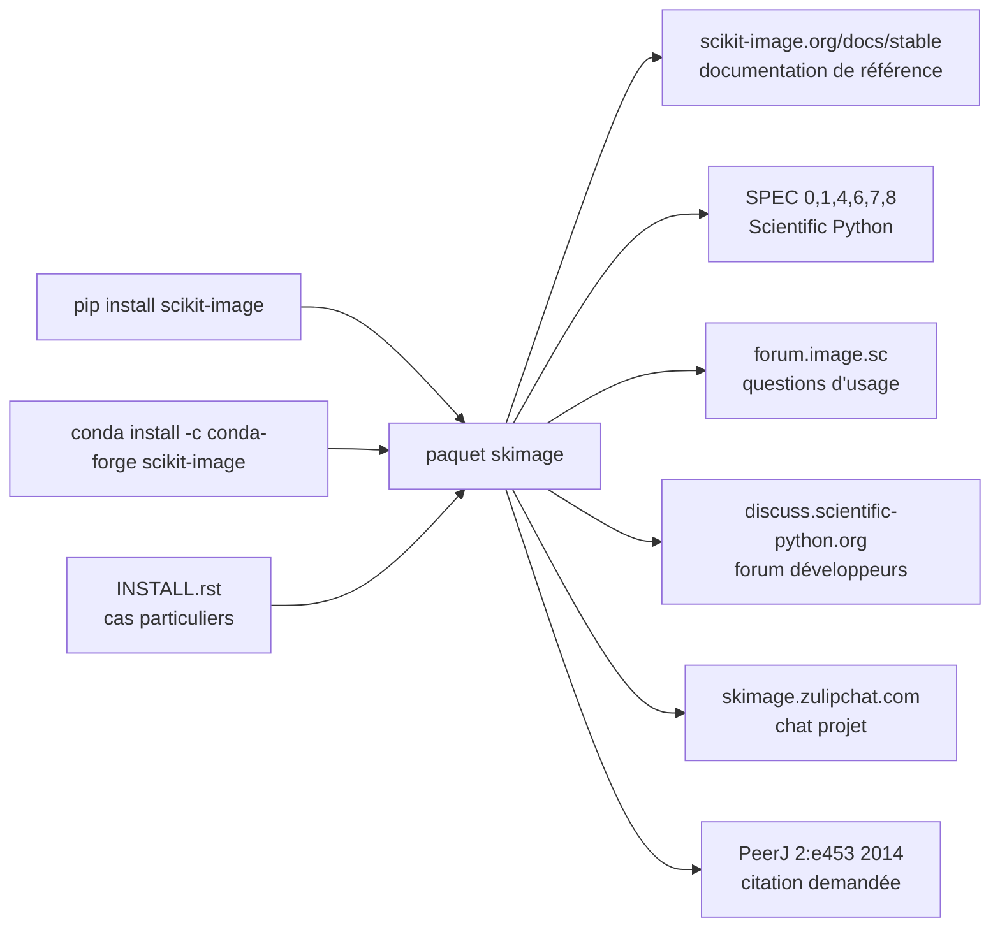

# scikit-image/scikit-image

> **La bibliothèque de traitement d'images en Python de l'écosystème scientifique, pour chercheurs et ingénieurs data.**

## Le problème

Sans elle, tout traitement d'image en Python se fait à la main sur des tableaux NumPy : filtres,
seuillages, segmentation, mesures de régions sont à réécrire à chaque projet, avec les erreurs de
bord et de type que cela suppose. L'alternative est de descendre vers des bibliothèques C, au prix
d'une chaîne de compilation et d'une API étrangère aux conventions scientifiques Python.

## Ce que ça fait vraiment

Le README de ce dépôt est volontairement minimal : il se présente en une phrase,
« scikit-image: Image processing in Python », et renvoie tout le reste à la documentation en
ligne. Il faut le dire nettement : **le contenu fonctionnel n'est pas documenté ici**, aucune
liste de modules, aucun exemple de code, aucune capture.

Ce que le README établit réellement :

- Le paquet s'installe par `pip` ou par `conda` depuis le canal `conda-forge`, et un fichier
  `INSTALL.rst` séparé détaille les cas particuliers.
- Le projet suit les SPEC 0, 1, 4, 6, 7 et 8 de Scientific Python — c'est-à-dire les conventions
  partagées de l'écosystème (fenêtre de support des versions, conventions de nommage, générateurs
  aléatoires…), ce qui en dit plus long sur la tenue du projet que n'importe quel argumentaire.
- La communauté est adossée à trois canaux distincts : le forum image.sc, un forum développeurs sur
  discuss.scientific-python.org, et un chat Zulip — signe d'un projet à gouvernance collective, pas
  d'un dépôt personnel.
- Un score de santé LFX (Linux Foundation Insights) est affiché en badge.
- Une citation académique est demandée : van der Walt *et al.*, PeerJ 2:e453 (2014).

## Comment c'est branché

Aucun diagramme tiré du code n'existe pour ce dépôt, et le README ne décrit pas l'architecture :
le schéma ci-dessous se limite donc à ce que le README affirme — les voies d'installation, les
lieux de documentation et les canaux communautaires. Il ne prétend pas représenter les modules
internes de `skimage`.



## Essayer

Le README ne documente que l'installation — aucune commande d'usage, aucun extrait de code. Les
deux seules lignes qu'il donne, telles quelles :

```bash
pip install scikit-image

conda install -c conda-forge scikit-image
```

Pour tout le reste (premier exemple, galerie, tutoriels), le README renvoie à
`https://scikit-image.org/docs/stable/`, hors périmètre de cette fiche.

## Coût et pièges

- **Aucun coût monétaire, aucun compte, aucune clé d'API, aucun service tiers** : c'est un paquet
  Python installable, rien n'est appelé sur le réseau à l'exécution d'après le README.
- **Pas de GPU requis ni mentionné** : le README n'évoque aucune accélération matérielle.
- **Licence à vérifier** : le README se contente de renvoyer à `LICENSE.txt` sans nommer la
  licence, et le catalogue relève `NOASSERTION` — GitHub n'a pas su l'identifier. À lever sur le
  fichier du dépôt avant tout usage en produit fermé ; c'est la raison de l'alerte.
- **Fenêtre de versions Python mouvante** : le respect de la SPEC 0 signifie que les versions
  anciennes de Python et de NumPy sont retirées du support selon un calendrier glissant. Un
  environnement figé depuis longtemps finira par sortir de la fenêtre supportée.
- **Citation attendue** en cas d'usage académique — coût non financier mais réel dans un cadre
  de publication.

## Ce que ce n'est pas

- **Ce n'est pas une bibliothèque de vision par ordinateur par apprentissage profond.** Le README
  ne mentionne ni modèle, ni entraînement, ni inférence : le domaine annoncé est le traitement
  d'images, pas la détection d'objets apprise.
- **Ce n'est pas une application ni une interface graphique** : rien à lancer, c'est un paquet à
  importer depuis son propre code.
- **Ce README n'est pas une documentation.** Il ne dit pas ce que le paquet contient ; tout le
  savoir utile vit sur le site externe. Juger le projet sur ce fichier seul serait une erreur —
  d'où l'alerte `matière insuffisante`, qui porte sur le README, pas sur le projet.

## Alternatives

| | Quand le préférer |
|---|---|
| **kornia/kornia** | Traitement d'images différentiable sur tenseurs PyTorch, avec GPU. À préférer quand les opérations doivent s'insérer dans un graphe d'entraînement ou tourner sur GPU ; scikit-image à préférer pour l'analyse scientifique sur tableaux NumPy, en CPU, hors apprentissage. |
| **roboflow/supervision** | Outillage autour de la détection d'objets (boîtes, masques, annotations, suivi). À préférer quand le point de départ est un modèle de détection déjà entraîné ; scikit-image n'intervient pas à ce niveau. |

Les autres voisins du catalogue (`PennyLaneAI/pennylane`, `huggingface/lerobot`) ne sont pas
comparables : calcul quantique et robotique, aucun rapport avec le traitement d'images.

## Pour toi

À adopter sans hésiter, au même titre que NumPy ou SciPy : c'est la brique par défaut dès qu'un
pipeline data touche à des images avant l'étape modèle — nettoyage, seuillage, segmentation,
extraction de mesures, préparation de jeux d'entraînement. La gouvernance communautaire, l'adhésion
aux SPEC et l'ancienneté en font une dépendance à faible risque technique ; le seul point à traiter
avant un usage en produit fermé est la vérification de la licence dans `LICENSE.txt`.
