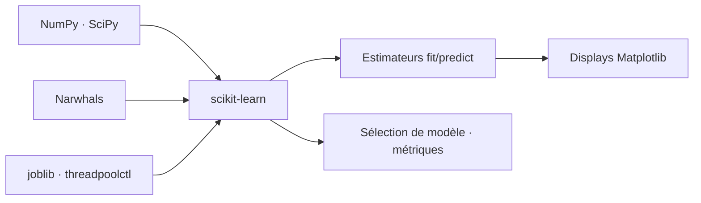

# scikit-learn/scikit-learn

> Bibliothèque Python de machine learning classique, bâtie sur SciPy.

## Le problème
Réimplémenter régression, arbres, clustering et validation croisée à chaque projet coûte du temps et introduit des erreurs silencieuses.

## Ce que ça fait vraiment
Fournit les algorithmes de ML classique avec une API homogène (`fit`/`predict`), plus les outils de sélection de modèle et d'évaluation. Dépend de NumPy ≥ 1.26, SciPy ≥ 1.11.4, Narwhals ≥ 2.0.1, joblib, threadpoolctl ; Python ≥ 3.12. Matplotlib ≥ 3.8 est requis pour les fonctions `plot_*` et classes `Display`. Démarré en 2007 par David Cournapeau, maintenu par une communauté avec le soutien de plusieurs organisations.

## Comment c'est branché


## Essayer
```bash
pip install -U scikit-learn
conda install -c conda-forge scikit-learn
pytest sklearn
```

## Coût et pièges
Gratuit, licence BSD 3 clauses. La variable `SKLEARN_SEED` contrôle l'aléa pendant les tests. Les versions minimales de NumPy/SciPy sont strictes et peuvent contraindre un environnement existant.

## Ce que ce n'est pas
Ce n'est pas du deep learning : pas de réseaux de neurones entraînables sur GPU. Pas de gestion de données distribuées. Les fonctions de tracé sont un confort, pas une bibliothèque de dataviz.

## Alternatives
- scikit-image : pour le traitement d'images, cité comme dépendance d'exemples.

## Pour toi
À adopter sans discussion : c'est le socle du ML tabulaire, et la référence contre laquelle comparer toute alternative.
