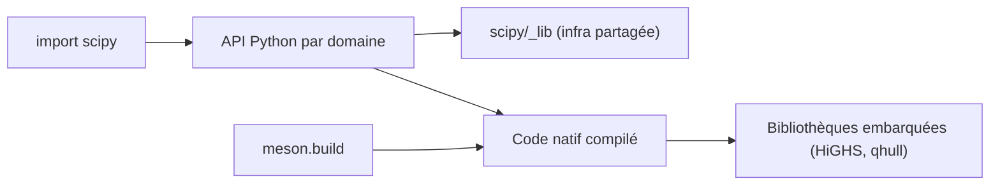

# scipy/scipy

> Bibliothèque Python de calcul scientifique sur NumPy : optimisation, algèbre linéaire, statistiques, signal.

## Le problème
Avoir des algorithmes numériques fiables (intégration, optimisation, statistiques, FFT, matrices creuses) sans les réécrire ni lier soi-même du C ou du Fortran.

## Ce que ça fait vraiment
Sous-paquets par domaine : `optimize`, `linalg`, `sparse`, `stats`, `signal`, `fft`, `integrate`, `interpolate`, `spatial`, `special`, `ndimage`. L'API Python appelle du code compilé (C, C++, Cython, Fortran) et des bibliothèques embarquées (HiGHS, qhull, SuperLU, ARPACK…). Construction via Meson ; suites de tests, benchmarks et documentation Sphinx dans le même dépôt.

## Comment c'est branché

## Essayer
Aucune commande dans ce README : il renvoie au guide d'installation officiel et au forum de développement.

## Coût et pièges
Gratuit. Installer depuis les sources demande une chaîne de compilation complète (C, C++, Fortran) ; passer par un paquet précompilé. Le README mentionne une politique sur l'usage de l'IA pour les contributions.

## Ce que ce n'est pas
Ce n'est pas un framework d'apprentissage profond ni un outil de dataframes ; il travaille sur des tableaux NumPy.

## Alternatives
Le README ne nomme que NumPy, avec lequel SciPy fonctionne ; aucune alternative citée.

## Pour toi
Adopter : socle standard sous scikit-learn et une grande partie de la pile data, soutenu par NumFOCUS et actif (push en septembre 2026).

