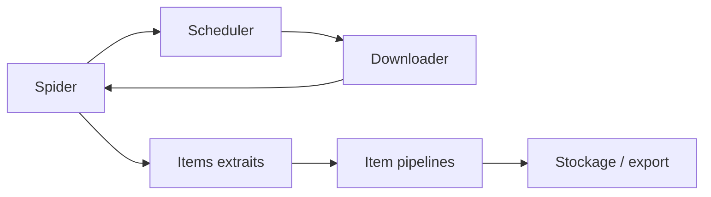

# scrapy/scrapy

> Framework Python d'extraction de données structurées depuis des sites web.

## Le problème
Écrire un crawler à la main veut dire gérer soi-même la file d'URL, la concurrence, les retries et le parsing.

## Ce que ça fait vraiment
Le README fourni tient en quelques lignes : framework de web scraping pour extraire des données structurées, multiplateforme, Python 3.10+, maintenu par Zyte (ex-Scrapinghub) et de nombreux contributeurs. Le reste du contenu renvoie à la documentation en ligne et au guide de contribution.

## Comment c'est branché


## Essayer
```bash
pip install scrapy
```

## Coût et pièges
Gratuit. Le README n'indique ni licence, ni dépendances, ni contraintes réseau ; tout est renvoyé à la doc.

## Ce que ce n'est pas
Le README ne décrit ni le rendu JavaScript, ni la gestion des proxys, ni la politique robots.txt : autant de points à vérifier ailleurs. Ce n'est pas un outil clé en main sans code.

## Alternatives
Aucune alternative nommée dans le README.

## Pour toi
À adopter pour toute collecte web récurrente, mais la matière du README est insuffisante : la doc est le vrai point d'entrée.
