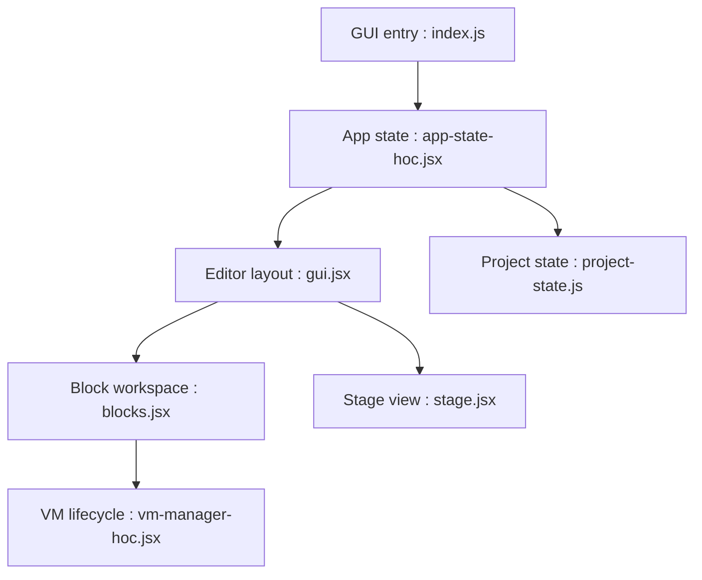

# scratchfoundation/scratch-gui

> Composants React de l'interface de Scratch 3.0, désormais migrés vers le mono-dépôt scratch-editor.

## Le problème
Fournir l'interface pour créer et exécuter des projets Scratch 3.0.

## Ce que ça fait vraiment
Ensemble de composants React : éditeur de blocs, scène, éditeurs de costumes et de sons, bibliothèques, tutoriels, sac à dos, connexion cloud. Un automate d'états (`project-state.js`) gère chargement, affichage et sauvegarde. Le projet tourne sur la VM Scratch.

## Comment c'est branché


## Essayer
```bash
git clone https://github.com/scratchfoundation/scratch-gui.git
cd scratch-gui
npm install
npm start
```

## Coût et pièges
Gratuit. Dépôt archivé : nouvelles issues et PR ailleurs. Licence AGPL-3.0 : obligations de publication du code pour un service réseau. Historique git lourd (`--depth=1` conseillé).

## Ce que ce n'est pas
Pas la version maintenue : la suite vit dans scratch-editor, publiée sous `@scratch/scratch-gui`.

## Alternatives
- scratch-editor : le mono-dépôt qui remplace ce dépôt.

## Pour toi
À ignorer : archivé et sous AGPL ; si Scratch t'intéresse, pars du mono-dépôt.

