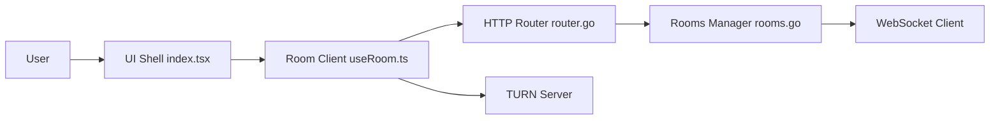

# screego/server

> Serveur auto-hébergé de partage d'écran WebRTC basse latence pour montrer du code.

## Le problème
Les outils de visio d'entreprise partagent l'écran avec lag ou qualité trop faible pour lire du code.

## Ce que ça fait vraiment
README très court : partage multi-utilisateurs via WebRTC, TURN intégré, binaire unique ou Docker.
D'après l'architecture : UI React, routeur HTTP Go avec auth, signalisation WebSocket par salles, médias en pair-à-pair éventuellement relayés par TURN.

## Comment c'est branché

## Essayer
Aucune commande documentée dans le README (renvoi vers Installation et Configuration externes).

## Coût et pièges
Gratuit, GPL-3.0. Traversée NAT à configurer (TURN).

## Ce que ce n'est pas
Pas un outil de visio : seulement le partage d'écran, en complément d'une autre solution.

## Alternatives
Aucune nommée dans le README.

## Pour toi
À ignorer : utilitaire de collaboration sans rapport avec la data ; README trop mince pour en dire plus.
