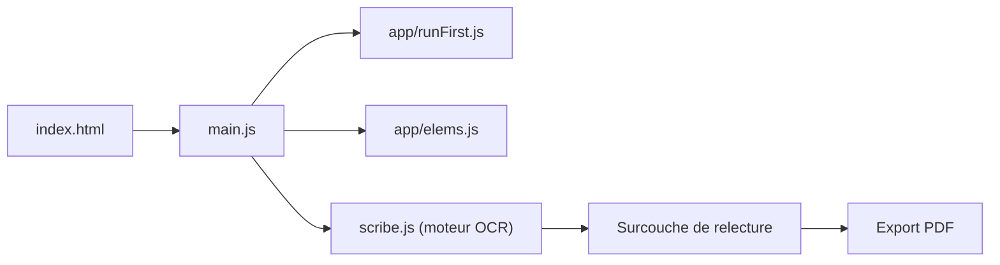

# scribeocr/scribeocr

> Application web d'OCR en local dans le navigateur, pour relire les résultats et produire des PDF interrogeables.

## Le problème
Les OCR ajoutent un texte invisible mal positionné, et corriger les erreurs est lent. Il faut aussi des documents numérisés fidèles et légers.

## Ce que ça fait vraiment
Interface qui superpose le texte OCR éditable sur l'image, colore les mots peu fiables et génère une police adaptée au document pour mieux aligner. Elle exporte un PDF classique (texte invisible) ou un PDF « mode ebook » à texte natif. La reconnaissance vient du dépôt séparé Scribe.js (sous-module) ; tout se passe dans le navigateur, sans envoi à un serveur.

## Comment c'est branché


## Essayer
```bash
git clone --recursive https://github.com/scribeocr/scribeocr.git
cd scribeocr
npm i
npx http-server
```

## Coût et pièges
Gratuit ; site public scribeocr.com ou serveur HTTP local (pas d'application de bureau). Le clonage exige `--recursive` pour le sous-module.

## Ce que ce n'est pas
Ce n'est pas le moteur OCR : les questions de qualité vont dans le dépôt Scribe.js. Ce n'est pas non plus une bibliothèque à embarquer.

## Alternatives
- Scribe.js : la bibliothèque de reconnaissance à intégrer dans son propre projet.
- Tesseract HOCR : format d'entrée que l'outil sait corriger.

## Pour toi
À surveiller : utile pour numériser et corriger des corpus de documents avant une chaîne d'IA, avec traitement 100 % local ; AGPL à noter.

