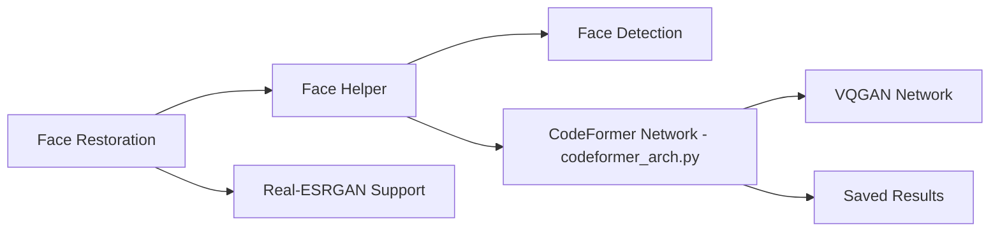

# sczhou/CodeFormer

> Modèle de restauration de visages flous ou abîmés (NeurIPS 2022), avec scripts de colorisation et d'inpainting.

## Le problème
Restaurer des visages dégradés dans des photos ou vidéos sans perdre leur identité.

## Ce que ça fait vraiment
Un transformer à recherche dans un codebook restaure des visages avec un poids de fidélité `w` entre 0 et 1. Scripts pour images complètes (détection, alignement, recomposition), vidéo, colorisation et inpainting de visages recadrés. Option Real-ESRGAN pour l'arrière-plan. Code d'entraînement publié.

## Comment c'est branché


## Essayer
```bash
git clone https://github.com/sczhou/CodeFormer
cd CodeFormer
conda create -n codeformer python=3.8 -y
conda activate codeformer
pip3 install -r requirements.txt
python basicsr/setup.py develop
python scripts/download_pretrained_models.py CodeFormer
python inference_codeformer.py -w 0.7 --input_path [image folder]|[image path]
```

## Coût et pièges
Gratuit. PyTorch ≥ 1.7.1 et CUDA ≥ 10.1. De nombreux sites tiers non officiels utilisent le modèle : le README met en garde contre les arnaques.

## Ce que ce n'est pas
Seules les démos Hugging Face, Replicate et OpenXLab sont officielles. Licence non identifiée par GitHub : l'usage commercial reste à vérifier.

## Alternatives
Aucune alternative nommée dans le README (Real-ESRGAN y est utilisé comme composant).

## Pour toi
À surveiller : restauration de visages efficace pour un projet de vision, mais pile ancienne et licence floue avant tout usage produit.

