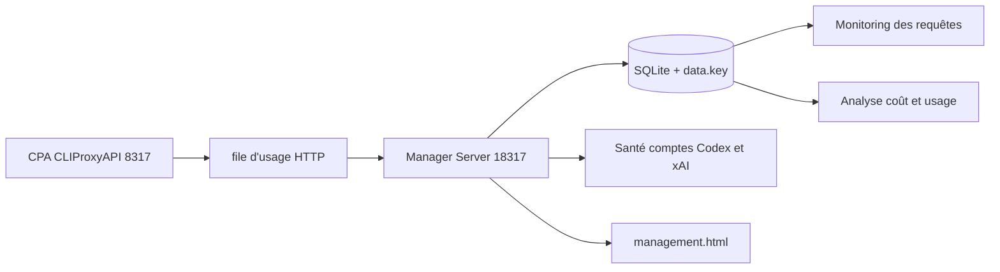

# seakee/CPA-Manager-Plus

> Panneau auto-hébergé d'administration et d'observabilité pour la passerelle CPA / CLIProxyAPI.

## Le problème
Une passerelle IA voit passer requêtes, coûts, quotas et échecs, mais ne les garde pas.
Quand un compte casse ou que la facture grimpe, il n'y a aucune trace à inspecter.

## Ce que ça fait vraiment
Persiste l'historique des requêtes en SQLite local : statut, latence, jetons, cache, trace, preuves d'échec expurgées.
Ventile appels, jetons, coût, latence et échecs par modèle, fournisseur, compte, clé d'API, projet, canal et période.
Synchronise les prix depuis models.dev, avec LiteLLM et OpenRouter en secours et des surcharges locales.
Inspecte les comptes Codex et xAI : fenêtres de quota, preuves de réinitialisation, file d'actions de récupération.

## Comment c'est branché


## Essayer
```bash
docker run -d \
  --name cpa-manager-plus \
  --restart unless-stopped \
  -p 18317:18317 \
  -v cpa-manager-plus-data:/data \
  seakee/cpa-manager-plus:latest
```

## Coût et pièges
Gratuit, sans inscription ni télémétrie, mais il faut une instance CPA en `v7.1.39+` à côté.
Les clés de gestion CPA sont chiffrées : une sauvegarde sans le fichier `data.key` est inexploitable.

## Ce que ce n'est pas
Pas un proxy : il administre et observe CPA, il ne relaie aucun trafic de modèle lui-même.
Pas une démo connectable — la démonstration en ligne utilise des données fictives.
Pas un remplaçant obligatoire : le panneau léger peut simplement se substituer à l'UI officielle sur `:8317`.

## Alternatives
Le Management Center officiel de CLI Proxy API, pour rester sur l'UI amont.
Le panneau léger CPAMP, si tu ne veux ni service ni base supplémentaires.

## Pour toi
Utile seulement si tu exploites déjà CLIProxyAPI ; sinon le couple à installer est disproportionné.
