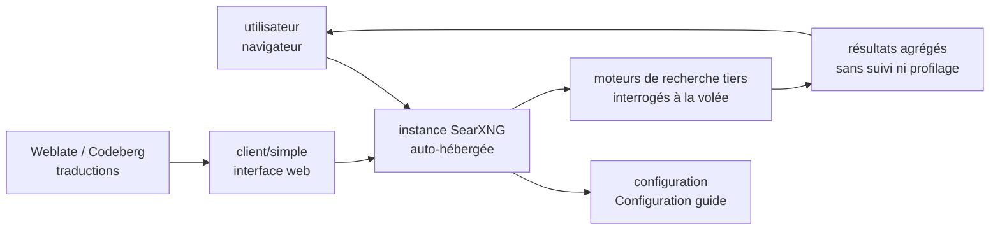

# searxng/searxng

> **A self-hosted metasearch engine for querying the web without being tracked or profiled.**

## The problem

Querying a search engine, by hand or from a program, hands a third party the full history of
your queries, and the results it chooses to show. The SearXNG README frames the problem in
exactly those terms and no other: users "are neither tracked nor profiled". Nothing else is
stated there as a motivation.

## What it actually does

The README's description is a single sentence: SearXNG is a metasearch engine, with a link to
the matching Wikipedia article for the definition. A metasearch engine has no index of its own:
it relays the query to several existing engines and aggregates their answers. Everything else —
which engines, how to enable them, which search categories, which API — is deferred to the
external documentation at `docs.searxng.org`, outside the material available here.

What the repository shows by itself: a Python project under the AGPL-3.0 licence, carried by a
GitHub organisation (`searxng`) rather than a single person, with ongoing commit activity and
community translation tracked on a Weblate instance hosted at Codeberg. There is a web client
(`client/simple/`, the source of the logo the README references) and a Matrix channel
`#searxng:matrix.org` for the community. The README describes neither the architecture, nor the
configuration options, nor any programmatic entry point.

## How it is wired



No code-derived diagram exists for this repository: this one is rebuilt from the README alone,
and is therefore coarse. The only file path the README exposes is the logo,
`client/simple/src/brand/searxng.svg`, which shows that a web client lives in the repository;
the engines that get queried, and how they are wired in, are not documented here.

## Trying it

No command is documented in the README. It gives two links only:

```
Installation  : https://docs.searxng.org/admin/installation.html
Configuration : https://docs.searxng.org/admin/settings/index.html
```

Nothing is reconstructed here: no `git clone`, no `pip install`, no `docker run`, because the
README contains none of them. Installation is described in the online documentation, which is
not reachable from this review.

## Cost and traps

- **The software is free, the hosting is not.** A self-hosted metasearch engine is a service
  that runs continuously: machine, domain name, updates, monitoring. The README quantifies none
  of this and mentions no cost at all.
- **AGPL-3.0 licence** (`SPDX-License-Identifier: AGPL-3.0-or-later` at the top of the README):
  the copyleft extends over the network. Any modification exposed to remote users must be
  published. That is the point to settle before folding SearXNG into an internal product that
  is reachable from outside.
- **De facto dependence on third-party engines**: a metasearch engine only works as long as the
  engines it relays keep answering. Blocks, rate limits and format changes are the ordinary
  maintenance of such a tool — the README says nothing about them, which does not make them go
  away.
- **Documentation is entirely external**: everything needed to decide (supported engines,
  settings, API) lives on `docs.searxng.org`. Budget a serious documentation read before the
  first install.

## What it is not

- **It is not a search engine.** There is no crawler, no index, no ranking of its own: SearXNG
  relays and aggregates. With no reachable third-party engines, it returns nothing.
- **It is not a ready-to-use service.** The README points at an installation guide and a
  configuration guide: you deploy and tune it yourself. Nothing indicates a hosted offering run
  by the project.
- **It is not end-to-end anonymity.** The README states that users are neither tracked nor
  profiled *by SearXNG*; what the downstream engines see is not described.
- **It is not an internal document search component**: nothing in the README mentions indexing
  your own documents, or a retrieval API for a RAG-style system.

## Alternatives

| | When to prefer it |
|---|---|
| **swirlai/swirl-search** | Catalogue neighbour, and the only genuinely comparable one: federated search across several sources with result aggregation. Prefer it when the goal is querying internal sources and enterprise services rather than public web engines. Prefer SearXNG for web search without profiling. |
| **neuml/txtai** | Catalogue neighbour, comparable only through the word "search": it is a semantic index over your own documents, with embeddings — a different problem, with no relaying to web engines. |

The README names no competing or related project: both entries above come from the catalogue
neighbours alone.

## For you

Worth watching rather than adopting as is, for two opposing reasons. On one side, a SearXNG
instance is the classic building block for giving an agent web access without a search API
billed per query — a real use for an AI-leaning profile. On the other, the README documents
neither an API, nor installation, nor configuration: you cannot decide to integrate on that
basis alone, and the AGPL needs a review before any exposed service. Read `docs.searxng.org`
before going further.
