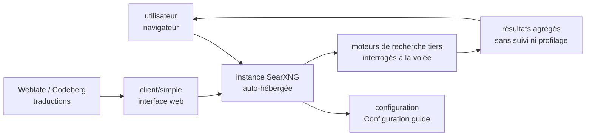

# searxng/searxng

> **Un métamoteur de recherche qu'on héberge soi-même, pour interroger le web sans être profilé.**

## Le problème

Interroger un moteur de recherche, à la main ou depuis un programme, revient à confier à un
tiers l'historique complet de ses requêtes, et à accepter les résultats qu'il choisit de
montrer. Le README de SearXNG pose le problème dans ces termes-là et pas d'autres : les
utilisateurs « ne sont ni suivis ni profilés ». Rien d'autre n'y est énoncé comme motivation.

## Ce que ça fait vraiment

Le README tient en une phrase de description : SearXNG est un *metasearch engine*, et il
renvoie vers l'article Wikipédia correspondant pour la définition. Un métamoteur n'a pas
d'index à lui : il relaie la requête vers plusieurs moteurs existants et agrège leurs
réponses. Tout le reste — quels moteurs, comment les activer, quelles catégories de recherche,
quelle API — est renvoyé à la documentation externe `docs.searxng.org`, hors de la matière
disponible ici.

Ce que le dépôt montre par lui-même : un projet en Python, sous licence AGPL-3.0, porté par une
organisation GitHub (`searxng`) et non par une personne, avec une activité de commits et une
traduction communautaire suivie sur une instance Weblate hébergée chez Codeberg. Il existe une
interface web (`client/simple/`, d'où provient le logo référencé dans le README) et un canal
Matrix `#searxng:matrix.org` pour la communauté. Le README ne décrit ni l'architecture, ni les
options de configuration, ni un mode d'appel programmatique.

## Comment c'est branché



Aucun diagramme tiré du code n'existe pour ce dépôt : ce schéma est reconstruit depuis le seul
README, et reste donc grossier. Le seul nom de fichier que le README expose est le chemin du
logo, `client/simple/src/brand/searxng.svg`, qui indique l'existence d'un client web dans le
dépôt ; les moteurs interrogés et la façon dont ils sont branchés ne sont pas documentés ici.

## Essayer

Aucune commande n'est documentée dans le README. Il ne donne que deux liens :

```
Installation  : https://docs.searxng.org/admin/installation.html
Configuration : https://docs.searxng.org/admin/settings/index.html
```

Rien n'est reconstruit ici : pas de `git clone`, pas de `pip install`, pas de `docker run`,
parce que le README n'en contient aucun. L'installation se lit dans la documentation en ligne,
qui n'est pas accessible depuis cette veille.

## Coût et pièges

- **Le logiciel est gratuit, l'hébergement ne l'est pas.** Un métamoteur auto-hébergé est un
  service qui tourne en permanence : machine, nom de domaine, mises à jour, surveillance. Le
  README ne chiffre rien de tout cela et n'évoque aucun coût.
- **Licence AGPL-3.0** (`SPDX-License-Identifier: AGPL-3.0-or-later` en tête du README) : le
  copyleft s'étend au réseau. Toute modification exposée à des utilisateurs distants doit être
  publiée. C'est le point à trancher avant d'intégrer SearXNG à un produit interne rendu
  accessible à l'extérieur.
- **Dépendance de fait aux moteurs tiers** : un métamoteur ne fonctionne que tant que les
  moteurs qu'il relaie répondent. Blocages, limitations de débit et changements de format sont
  la maintenance ordinaire de ce type d'outil — le README n'en dit rien, ce qui ne les
  supprime pas.
- **Documentation entièrement externe** : tout ce qui permet de décider (moteurs pris en
  charge, réglages, API) vit sur `docs.searxng.org`. Compter une lecture de documentation
  sérieuse avant la première installation.

## Ce que ce n'est pas

- **Ce n'est pas un moteur de recherche.** Il n'y a ni robot d'indexation, ni index, ni
  classement propre : SearXNG relaie et agrège. Sans moteurs tiers accessibles, il ne renvoie
  rien.
- **Ce n'est pas un service prêt à l'emploi.** Le README pointe vers un guide d'installation et
  un guide de configuration : il faut déployer et régler soi-même. Rien n'indique une offre
  hébergée par le projet.
- **Ce n'est pas une garantie d'anonymat de bout en bout.** Le README affirme que les
  utilisateurs ne sont ni suivis ni profilés *par SearXNG* ; ce que voient les moteurs
  interrogés en aval n'est pas décrit.
- **Ce n'est pas un composant de recherche documentaire interne** : rien dans le README ne
  mentionne l'indexation de ses propres documents, ni une API de récupération pour un système
  de type RAG.

## Alternatives

| | Quand le préférer |
|---|---|
| **swirlai/swirl-search** | Voisin du catalogue et seul réellement comparable : recherche fédérée sur plusieurs sources avec agrégation des résultats. À préférer si l'objectif est d'interroger des sources internes et des services d'entreprise plutôt que des moteurs web publics. SearXNG à préférer pour la recherche web sans profilage. |
| **neuml/txtai** | Voisin du catalogue, comparable seulement par le mot « recherche » : c'est une base d'index sémantique sur ses propres documents, avec embeddings — un problème différent, sans relais vers des moteurs web. |

Le README ne nomme aucun projet concurrent ni apparenté : les deux entrées ci-dessus viennent
uniquement des voisins du catalogue.

## Pour toi

À surveiller plutôt qu'à adopter en l'état, pour deux raisons opposées. D'un côté, une instance
SearXNG est la brique classique pour donner un accès web à un agent sans passer par une API de
recherche facturée à la requête — un usage réel pour un profil IA. De l'autre, le README ne
documente ni API, ni installation, ni configuration : impossible de décider d'intégrer sur
cette seule base, et l'AGPL demande un examen avant tout service exposé. Lire
`docs.searxng.org` avant d'aller plus loin.
