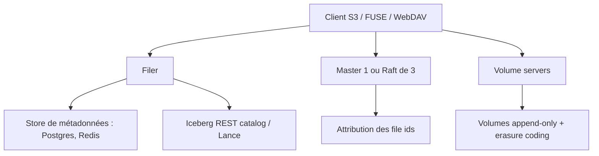

# seaweedfs/seaweedfs

> Système de fichiers distribué : un binaire `weed` qui sert S3, POSIX et un lakehouse.

## Le problème
Stocker des milliards de petits fichiers casse les systèmes conçus pour les gros : un inode par fichier, plusieurs I/O par lecture.
Ajouter de la capacité déclenche une redistribution coûteuse des données.

## Ce que ça fait vraiment
Un seul binaire `weed` sert un objet store S3, un système de fichiers POSIX et un lakehouse avec S3 Tables, sur les mêmes données.
Un blob = une lecture disque ; 40 octets de métadonnées par fichier sur disque, index mémoire de 16 octets par blob côté serveur de volumes.
La passerelle S3 implémente 73 opérations objet/bucket, 36 S3 Tables, 39 IAM, 5 STS : versioning, Object Lock, lifecycle, CORS, presigned URLs, SSE-S3/KMS/C, politiques de bucket.
Catalogue Iceberg REST et namespace Lance intégrés (ni Hive Metastore ni Glue à déployer) ; Cloud Drive monte un bucket distant et le sert à vitesse locale ; réplication actif-actif entre clusters.

## Comment c'est branché


## Essayer
```bash
curl -fsSL https://raw.githubusercontent.com/seaweedfs/seaweedfs/master/install.sh | bash
AWS_ACCESS_KEY_ID=admin AWS_SECRET_ACCESS_KEY=secret S3_BUCKET=my-bucket ./weed mini -dir=./data
weed volume -dir=/data -master=<master_host>:9333
```

## Coût et pièges
Gratuit et open source, mais une édition Enterprise payante existe (récupération de données, auto-réparation, EC vacuum).
Le store de métadonnées du filer est un service que vous opérez en plus ; `weed mini` ne convient qu'au mono-nœud.

## Ce que ce n'est pas
Ce n'est pas un remplaçant de HDFS pour les très gros fichiers : l'optimisation vise les petits fichiers nombreux.
Ce n'est pas un système qui rééquilibre tout seul : rien ne bouge tant que vous ne le demandez pas.
Les chiffres de benchmark cités sont explicitement « non scientifiques », mesurés sur un MacBook.

## Alternatives
- Ceph — même famille, plus complexe ; placement CRUSH qui migre les données à chaque changement de topologie.
- MinIO / RustFS — API S3 très proche d'AWS ; le README note que MinIO a cessé son développement en avril 2026.
- GlusterFS, MooseFS, HDFS — comparés dans le README, moins adaptés aux petits fichiers.

## Pour toi
Le candidat sérieux si tu veux un S3 auto-hébergé pour tes datasets et tes artefacts de modèles, sans facture cloud.
