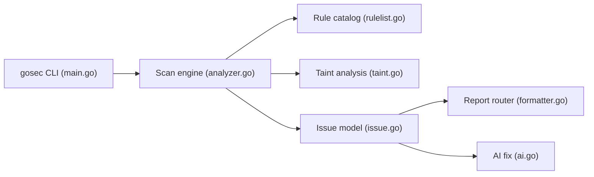

# securego/gosec

> Scanner de sécurité pour le code Go, analysant l'AST et le SSA, pour développeurs et CI.

## Le problème
Les failles courantes en Go (injection, traversée de chemin, crypto faible) passent inaperçues en revue de code.

## Ce que ça fait vraiment
Règles par motifs (G1xx à G6xx), analyseurs SSA (conversions, bornes de tranches, crypto) et analyse de teinte (G7xx : SQL, commandes, SSRF, XSS…). Chaque alerte est associée à un CWE. Sorties text, json, yaml, csv, junit-xml, html, sonarqube, golint, sarif. Annotations `#nosec`. Suggestions de correction par IA en option.

## Comment c'est branché


## Essayer
```bash
go install github.com/securego/gosec/v2/cmd/gosec@latest
gosec ./...
gosec -fmt sarif -out results.sarif ./...
```

## Coût et pièges
Gratuit ; Go 1.25+. Le mode correction IA envoie du code à un fournisseur externe avec ta clé d'API. Faux positifs à gérer via `#nosec`.

## Ce que ce n'est pas
Ni scanner de dépendances ni outil multi-langage : Go uniquement. Pas une preuve d'absence de faille.

## Alternatives
Aucune nommée dans le README.

## Pour toi
À adopter dès que tu as du code Go (opérateurs, outils MLOps) : l'intégration CI et SARIF coûte presque rien.

