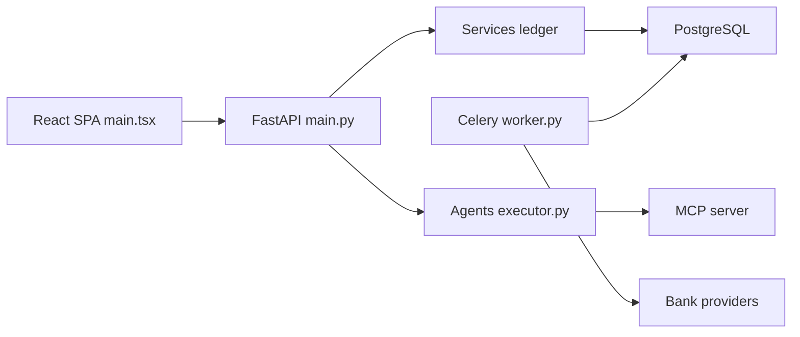

# securo-finance/securo

> Gestionnaire de finances personnelles auto-hébergé, avec synchronisation bancaire et agents IA optionnels.

## Le problème
Les applications de budget centralisent tes données bancaires chez un tiers.

## Ce que ça fait vraiment
FastAPI, PostgreSQL, Celery/Redis et un front React. Comptes, transactions (import OFX, QIF, CAMT, CSV), règles de catégorisation, budgets, objectifs, actifs, rapports, multi-devises et multi-utilisateurs. Synchronisation via Pluggy (Brésil), Enable Banking (PSD2) ou SimpleFIN. Authentification locale, TOTP, passkeys et OIDC. Les agents IA (OpenAI, Anthropic, Ollama) interrogent les données par un serveur MCP intégré et une base de connaissances RAG.

## Comment c'est branché


## Essayer
```bash
curl -fsSL https://usesecuro.com/install.sh | bash
git clone https://github.com/securo-finance/securo.git && cd securo
docker compose up --build
# http://localhost:3000
```

## Coût et pièges
Gratuit en auto-hébergement. La synchronisation bancaire demande un compte chez un fournisseur ; Enable Banking exige HTTPS, et son offre gratuite impose de lier les comptes à la main. Les agents sont désactivés par défaut. 237 issues ouvertes.

## Ce que ce n'est pas
Pas un outil de données ou de ML : une application finale. Le README indique qu'une partie du code a été écrite avec l'aide d'IA, relue par des humains. AGPL-3.0 : obligations de publication si tu l'exposes en service.

## Alternatives
Aucune alternative n'est citée dans le README.

## Pour toi
À ignorer pour ton métier : bonne application perso, mais sans rapport avec le pipeline data/IA et sous AGPL.
