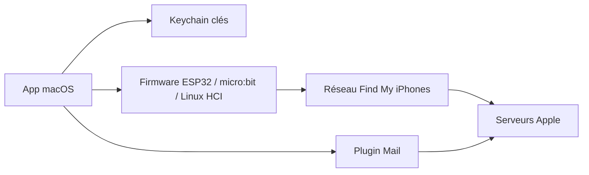

# seemoo-lab/openhaystack

> Cadre pour suivre des appareils Bluetooth personnels via le réseau Localiser d'Apple, issu de recherche.

## Le problème
Les traceurs du commerce sont fermés ; ce projet documente et réutilise le fonctionnement du réseau Find My.

## Ce que ça fait vraiment
Une app macOS génère des paires de clés (P-224), la clé publique est déployée sur un micro:bit, un ESP32 ou une machine Linux qui émet des annonces BLE. Les iPhones proches téléversent des positions chiffrées ; l'app les télécharge et les déchiffre avec la clé privée du trousseau. Un plugin Apple Mail fournit l'authentification. Une version mobile Flutter existe, avec un serveur proxy sur Mac.

## Comment c'est branché


## Essayer
```bash
sudo spctl --master-disable
sudo defaults write "/Library/Preferences/com.apple.mail" EnableBundles 1
sudo spctl --master-enable
```
Ces commandes du README servent à activer le plugin Mail ; l'app se télécharge en binaire ou se compile sous Xcode.

## Coût et pièges
Exige macOS 11, désactivation temporaire de Gatekeeper, et un compte Apple. Le firmware émet une clé fixe : les balises sont pistables par d'autres. Logiciel « expérimental, non testé » selon l'auteur.

## Ce que ce n'est pas
Pas affilié à Apple. Utiliser la clé fixe expose à un pistage tiers.

## Alternatives
Aucune alternative citée dans le README.

## Pour toi
À surveiller : intéressant comme cas d'étude de sécurité et de chiffrement, mais fragile et sans utilité data/IA directe.

