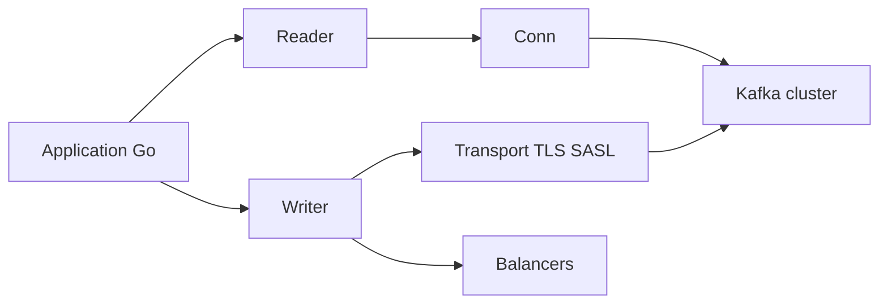

# segmentio/kafka-go

> Client Go pour Apache Kafka, avec API bas niveau et haut niveau qui suivent les conventions de la bibliothèque standard.

## Le problème
Les clients Go existants étaient jugés difficiles (sarama), dépendants d'une bibliothèque C (confluent-kafka-go) ou trop spécialisés (goka).

## Ce que ça fait vraiment
Type `Conn` de bas niveau, `Reader` avec reconnexion, gestion des offsets, groupes de consommateurs et commits explicites, `Writer` avec retries, répartiteurs (Hash, LeastBytes, CRC32, Murmur2) et compression (Snappy). Il gère TLS et SASL (Plain, SCRAM), le contexte Go, et un journal configurable. Le README donne des équivalents pour les partitionneurs de Sarama, librdkafka et du client Java.

## Comment c'est branché


## Essayer
```bash
docker-compose up -d
KAFKA_VERSION=2.3.1 KAFKA_SKIP_NETTEST=1 go test -race ./...
```
Ce sont les commandes de test ; l'usage est donné en exemples Go dans le README.

## Coût et pièges
Gratuit, mais il faut un cluster Kafka. Testé avec Kafka 0.10.1.0 à 2.7.1 et Go 1.15+ : les fonctions plus récentes de Kafka peuvent manquer. `kafka.NewWriter` et `WriterConfig` sont annoncés comme dépréciés. Il faut fermer le `Reader` à l'arrêt du processus.

## Ce que ce n'est pas
Ce n'est pas un client Python ni un framework de flux : c'est un client Go. Les limites des groupes de consommateurs (pas de `SetOffset`, `Lag` à -1) sont documentées.

## Alternatives
sarama : plus répandu, API de bas niveau. confluent-kafka-go : documentation plus riche, mais dépend de librdkafka en cgo. goka : abstraction de bus de messages, dépend de sarama.

## Pour toi
Ignorer si ton stack est Python ; à retenir uniquement pour des services Go qui lisent ou écrivent dans Kafka.

