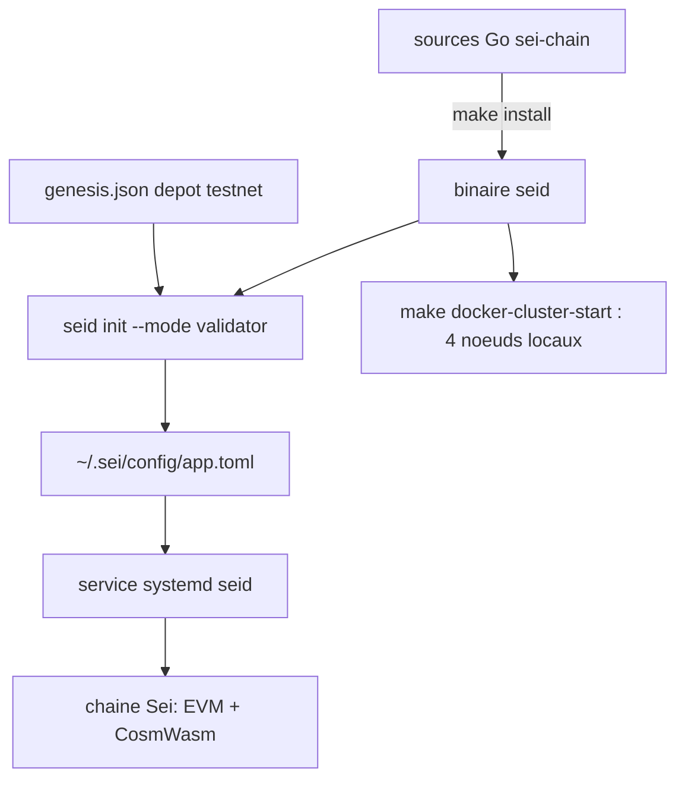

# sei-protocol/sei-chain

> **The Sei node software: a delegated proof-of-stake L1 running both EVM and CosmWasm.**

## The problem

Running a node or a validator on an L1 chain means compiling the right binary yourself,
fetching the right genesis file, and wiring the system service by hand.

## What it actually does

- Ships `seid`, the Sei chain node binary, built from Go sources with `make install`.
- Manages keys via `seid keys add`, including mnemonic recovery and Ledger devices.
- Initialises a node with `seid init --mode validator` and runs it as a systemd unit.
- Executes EVM and CosmWasm transactions; the README claims 400 ms blocks through
  "twin turbo consensus", optimistic parallelisation and a SeiDB storage engine.
- Brings up a local 4-node cluster through Docker make targets.
- Since v6.7 the IBC module is removed: IBC queries and historical transfer decoding are no
  longer served, and a frozen v6.6 node is needed for pre-v6.7 IBC history.

## How it is wired

The repository yields a single binary; everything else is node configuration.



## Trying it

```bash
git clone https://github.com/sei-protocol/sei-chain
cd sei-chain
git checkout $VERSION
make install
seid keys add [key_name]
seid init <moniker> --chain-id sei-testnet-1 --mode validator
wget https://github.com/sei-protocol/testnet/raw/main/sei-testnet-1/genesis.json -P $HOME/.sei/config/
sed -i 's/minimum-gas-prices = ""/minimum-gas-prices = "0.01usei"/g' $HOME/.sei/config/app.toml
sudo systemctl daemon-reload
sudo systemctl enable seid.service
systemctl start seid && journalctl -u seid -f
make docker-cluster-start
```

## Cost and gotchas

The software is free, the hardware is not: the README states a minimum of 64 GB RAM, a 1 TB
NVMe SSD and 16 cores, on Linux x86_64, with go1.18+ and git. Becoming a validator also means
delegating real `usei` tokens (`--amount <token delegation>usei`) and setting a commission
rate. The genesis file comes from a separate repository, `sei-protocol/testnet`.

## What it is not

It is not a library to import or an application SDK: it is the node itself.
It is not a hosted service either — no managed offering is documented here.
The performance figures (400 ms, "100x") are the README's own claims, not measured here.

## Alternatives

No comparable alternative in the catalogue: the README names no competing project (Solana
and Ethereum appear as reference ecosystems, not as repositories), and the batch line offers
no allowed neighbours to compare against.

## For you

Skip it if your work is data, AI or MLOps: nothing here touches models, pipelines or
datasets — it is blockchain infrastructure with a heavy hardware bill attached.
