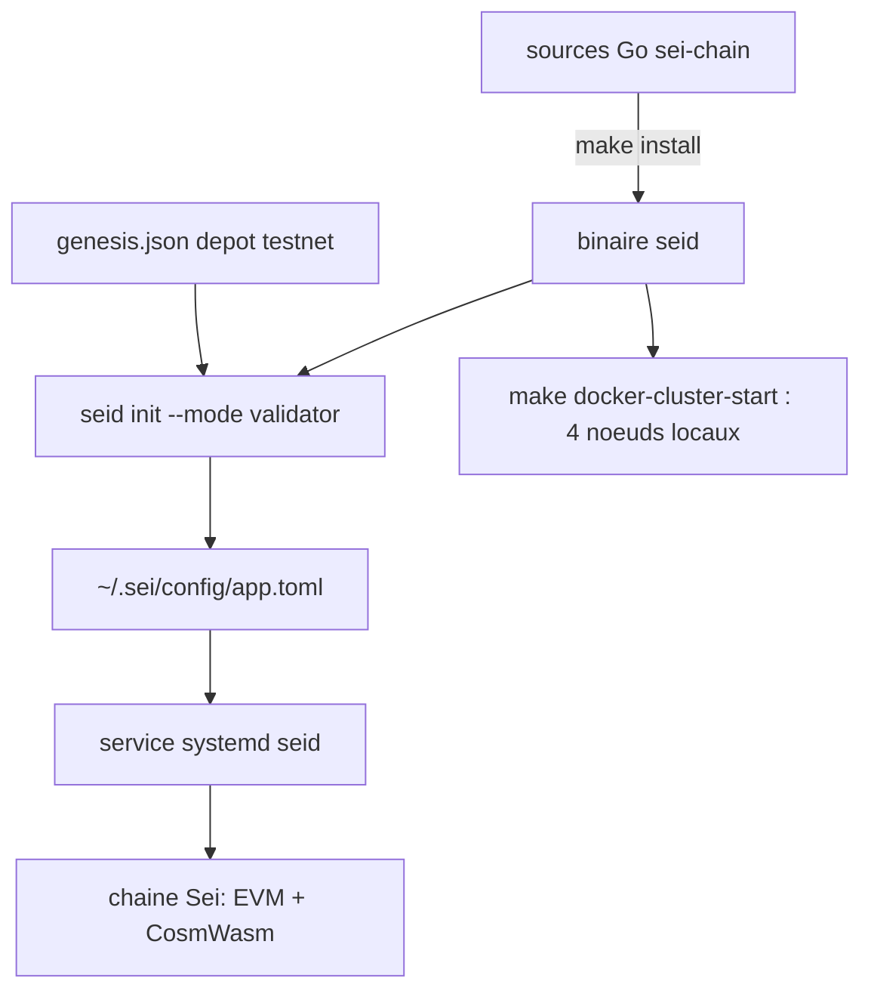

# sei-protocol/sei-chain

> **Le code du nœud Sei : une chaîne L1 à preuve d'enjeu déléguée exécutant EVM et CosmWasm.**

## Le problème

Faire tourner un nœud ou un validateur d'une chaîne L1 suppose de compiler le bon binaire,
de récupérer le bon fichier genesis et de câbler le service système soi-même.

## Ce que ça fait vraiment

- Fournit `seid`, le binaire de nœud de la chaîne Sei, compilé depuis les sources Go.
- Gère les clés (`seid keys add`, avec options `--recover` et `--ledger`).
- Initialise un nœud (`seid init --mode validator`) et le démarre comme service systemd.
- Exécute des transactions EVM et CosmWasm ; le README annonce des blocs de 400 ms via
  « twin turbo consensus », de la parallélisation optimiste et un moteur de stockage SeiDB.
- Permet de monter un cluster local de 4 nœuds via des cibles make Docker.
- Depuis la v6.7, le module IBC est retiré : les requêtes IBC et le décodage des transferts
  historiques ne sont plus servis, il faut un nœud v6.6 gelé pour l'historique antérieur.

## Comment c'est branché

Le dépôt produit un binaire unique ; le reste est de la configuration de nœud.



## Essayer

```bash
git clone https://github.com/sei-protocol/sei-chain
cd sei-chain
git checkout $VERSION
make install
seid keys add [key_name]
seid init <moniker> --chain-id sei-testnet-1 --mode validator
wget https://github.com/sei-protocol/testnet/raw/main/sei-testnet-1/genesis.json -P $HOME/.sei/config/
sed -i 's/minimum-gas-prices = ""/minimum-gas-prices = "0.01usei"/g' $HOME/.sei/config/app.toml
sudo systemctl daemon-reload
sudo systemctl enable seid.service
systemctl start seid && journalctl -u seid -f
make docker-cluster-start
```

## Coût et pièges

Le logiciel est gratuit, le matériel non : le README exige au minimum 64 Go de RAM, 1 To de
SSD NVMe et 16 cœurs, sous Linux x86_64, avec go1.18+ et git. Devenir validateur suppose en
plus de déléguer des jetons `usei` réels (`--amount <token delegation>usei`) et de fixer un
taux de commission. Le fichier genesis vient d'un dépôt externe `sei-protocol/testnet`.

## Ce que ce n'est pas

Ce n'est pas une bibliothèque à importer ni un SDK applicatif : c'est le nœud lui-même.
Ce n'est pas non plus un service hébergé — aucune offre managée n'est documentée ici.
Les chiffres de performance (400 ms, « 100x ») sont ceux du README, non mesurés ici.

## Alternatives

Aucune alternative comparable dans le catalogue : le README ne nomme aucun projet concurrent
(Solana et Ethereum y sont cités comme écosystèmes de référence, pas comme dépôts), et la
ligne du lot ne propose aucun voisin autorisé.

## Pour toi

Passe ton chemin si tu fais de la data, de l'IA ou du MLOps : rien ici ne touche aux modèles,
aux pipelines ou aux données — c'est de l'infrastructure blockchain, avec une facture matérielle lourde.
