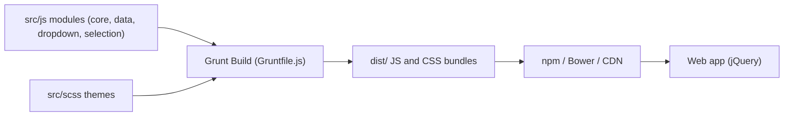

# select2/select2

> Plugin jQuery qui remplace les listes déroulantes HTML par des listes avec recherche, tags et chargement distant.

## Le problème
Les éléments select natifs n'offrent ni recherche, ni sélection multiple agréable, ni chargement paginé de gros jeux de données.

## Ce que ça fait vraiment
Améliore un `<select>` avec recherche, tags, imbrication d'optgroups, gabarits de rendu et données chargées par AJAX avec pagination. Les modules sont séparés : core, data (adaptateurs ajax, array, tags), dropdown, selection et i18n. Le build Grunt produit des bundles dans `dist/` avec enveloppe UMD ; des thèmes SCSS (classic, default) et de nombreuses intégrations tierces sont listés.

## Comment c'est branché

## Essayer
Le README ne donne pas de commande ; il propose un CDN (jsDelivr, cdnjs), un téléchargement depuis les releases, et renvoie vers select2.org.

## Coût et pièges
Gratuit. Dépend de jQuery. La compatibilité annoncée remonte à IE 8+ et Chrome 8+, signe d'un projet ancien. Une langue s'ajoute en incluant le bon fichier i18n.

## Ce que ce n'est pas
Ce n'est pas un composant React ou Vue : c'est un plugin jQuery, les intégrations sont de tiers.

## Alternatives
- Aucune alternative nommée dans le README.

## Pour toi
Ignorer : bibliothèque jQuery de formulaires, sans lien avec les données ou l'IA ; utile seulement pour maintenir un vieux front.

