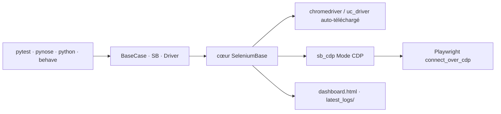

# seleniumbase/SeleniumBase

> Framework Python de test navigateur de bout en bout, avec modes furtifs CDP et Playwright.

## Le problème
Selenium brut échoue dès qu'un élément met du temps à charger, et chaque attente explicite ajoute
trois lignes de code.

## Ce que ça fait vraiment
SeleniumBase enveloppe Selenium avec des méthodes qui attendent par défaut : `self.click(sel)`
remplace `WebDriverWait(driver, 10).until(...)`. Trois syntaxes coexistent — classe `BaseCase`,
gestionnaire de contexte `SB()`, et `Driver()` — exécutables par pytest, pynose, python brut ou
behave. Le mode CDP (`sb_cdp`) contourne la détection de bots sur les navigateurs Chromium et le
mode Playwright furtif étend cette furtivité à Playwright en s'y connectant par CDP. La CLI `sbase`
génère fichiers et projets, enregistre les actions navigateur en code (`mkrec`, `--recorder`),
télécharge les webdrivers, et produit tableaux de bord et rapports HTML. Un serveur MCP
`seleniumbase-mcp` est disponible.

## Comment c'est branché


## Essayer
```bash
pip install seleniumbase
pip install playwright
pytest my_first_test.py
pytest test_coffee_cart.py --demo
pytest test_suite.py --rs --html=report.html --dashboard
sbase get chromedriver stable
```

## Coût et pièges
Gratuit. Chrome est le navigateur par défaut ; seuls Chromium non marqué et Chrome-for-Testing se
téléchargent automatiquement. `--pdb`, `--trace` et `--ftrace` sont explicitement déconseillés en CI.
Les options `--disable-cookies`, `--disable-js`, `--disable-csp` peuvent casser les pages.

## Ce que ce n'est pas
Ce n'est pas un outil neutre : le contournement de la détection de bots et `sb.solve_captcha()` sont
mis en avant dès la première ligne du README. Sur un site tiers, cet usage relève de ses conditions
de service. Ce n'est pas non plus un remplaçant de Playwright : les deux modes coexistent, SeleniumBase
fournissant la session furtive à laquelle Playwright se connecte.

## Alternatives
Le README ne compare qu'à Selenium brut, montrant ligne à ligne le code économisé ; Playwright y
figure comme intégration optionnelle, pas comme concurrent.

## Pour toi
Utile pour tester une interface interne ou collecter sur un site que tu contrôles ; les fonctions
anti-détection demandent d'être sûr de ton cadre juridique avant usage.
