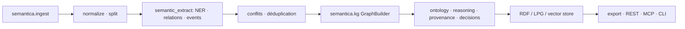

# semantica-agi/semantica

> Couche sémantique en graphe pour agents : contexte, raisonnement déterministe et traçabilité.

## Le problème
Un agent adossé à des embeddings renvoie des similarités sans structure ni relations, et ne sait pas
expliquer pourquoi un résultat est remonté.

## Ce que ça fait vraiment
Semantica construit un Context Graph et un graphe de connaissances à partir de données d'entreprise,
sans LLM obligatoire pour la construction, le raisonnement ou la provenance. Chaque décision
(`record_decision`) devient un nœud interrogeable, relié causalement (`add_causal_relationship`),
avec recherche de précédents, remontée de chaîne causale, carte d'impact et contrôle de conformité.
La provenance W3C PROV-O s'exporte en JSON, CSV ou RDF. Le raisonnement est déterministe : chaînage
avant, réseau Rete, Datalog, SPARQL. Le stockage est polyglotte (RDF : Oxigraph, Blazegraph, Jena,
RDF4J ; LPG : Neo4j, FalkorDB, AGE, Neptune) et les magasins vecteurs sont interchangeables.

## Comment c'est branché


## Essayer
```bash
pip install semantica
semantica doctor
```
```python
from semantica.context import ContextGraph
graph = ContextGraph(advanced_analytics=True)
decision_id = graph.record_decision(category="vendor_selection", scenario="...", reasoning="...", outcome="selected_aws", confidence=0.93)
chain = graph.trace_decision_chain(decision_id)
```

## Coût et pièges
Le paquet est gratuit et aucune licence n'est déclarée dans le README. Les connecteurs entreprise
(Databricks, Snowflake, SAP) s'installent par extras et impliquent comptes et identifiants ; le
README rappelle lui-même de ne jamais coder en dur `token`, `password` ou `private_key`. Certains
ingesteurs (DuckDB, Elasticsearch, Google Drive, HuggingFace, MongoDB, Pandas) existent mais ne sont
pas réexportés depuis `semantica.ingest` — import direct requis.

## Ce que ce n'est pas
Le README le précise : ce n'est pas de l'explicabilité du modèle de fondation. Le raisonnement
interne du LLM reste opaque ; Semantica explique ce qui est *autour* — contexte fourni, décision
produite, provenance, politiques appliquées. Ce n'est pas non plus un remplaçant de ta pile : LLM,
magasin vectoriel et framework d'agents restent en place.

## Alternatives
Le README compare seulement à deux catégories : « Vector DB + RAG » et « mémoire LLM brute », sans
nommer de projet concurrent.

## Pour toi
Le discours produit est dense et le README est tronqué à mi-parcours : à évaluer sur un cas réel de
traçabilité réglementaire avant d'y engager quoi que ce soit.
