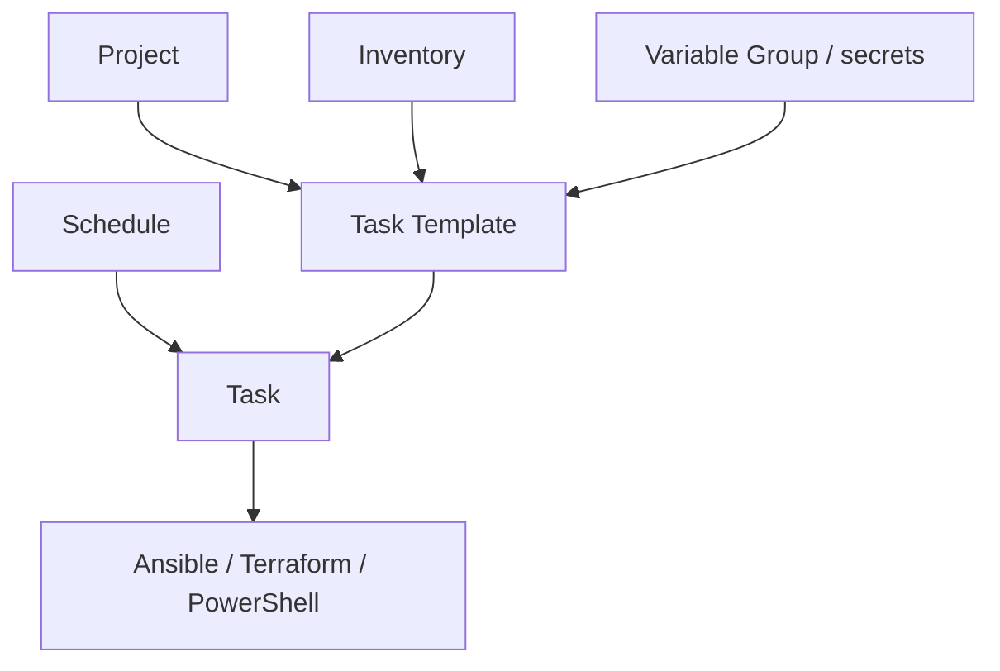

# semaphoreui/semaphore

> Interface web pour lancer et planifier Ansible, Terraform/OpenTofu et scripts PowerShell.

## Le problème
Quand le projet grandit, déployer depuis le terminal ne tient plus : personne ne sait qui a lancé
quoi, ni quand, ni avec quels secrets.

## Ce que ça fait vraiment
Semaphore expose une UI web pour exécuter des playbooks Ansible, du code Terraform et OpenTofu, des
scripts Bash et PowerShell. Il notifie sur échec et contrôle les accès au système de déploiement.
Son modèle repose sur six objets : Projects, Task Templates, Task, Schedules, Inventory et Variable
Group (qui porte les variables d'environnement et secrets).

## Comment c'est branché


## Essayer
```bash
docker run -p 3000:3000 --name semaphore \
	-e SEMAPHORE_DB_DIALECT=sqlite \
	-e SEMAPHORE_ADMIN=admin \
	-e SEMAPHORE_ADMIN_PASSWORD=changeme \
	-e SEMAPHORE_ADMIN_NAME=Admin \
	-e SEMAPHORE_ADMIN_EMAIL=admin@localhost \
	-d semaphoreui/semaphore:latest
```

## Coût et pièges
Gratuit. Le mot de passe admin d'exemple est `changeme` — à changer avant toute exposition. Les
Variable Groups stockent des secrets : c'est le point sensible de l'installation. Docker est la
voie principale, mais Snap, binaire et paquets Debian/RPM existent aussi.

## Ce que ce n'est pas
Ce n'est pas un moteur d'exécution : Semaphore pilote Ansible, Terraform et consorts, il ne les
remplace pas. Ce n'est pas non plus un CI/CD généraliste, et la section SaaS du README est
commentée — pas d'offre hébergée mise en avant.

## Alternatives
Aucun concurrent nommé ; le README liste seulement l'écosystème autour (collections Ansible
Ebdruplab, serveur MCP SemaphoreUI, provider Terraform, module PSSemaphore).

## Pour toi
Pertinent si tu déploies des environnements de données par Ansible ou Terraform et que tu veux
tracer et planifier les exécutions sans monter une chaîne CI complète.
