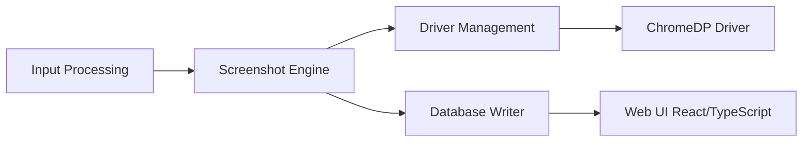

# sensepost/gowitness

> Outil Go qui capture des pages web avec Chrome sans interface, pour cartographier des cibles.

## Le problème
Vérifier visuellement des centaines d'interfaces web (résultats de scan) est fastidieux à la main.

## Ce que ça fait vraiment
Des lecteurs (URL, CIDR, Nmap, Nessus) alimentent un moteur de capture basé sur chromedp ou go-rod. Des écrivains enregistrent les résultats en SQLite, CSV ou JSON lines, avec journaux de requêtes, en-têtes et cookies. Une interface web et une API REST permettent de parcourir les captures.

## Comment c'est branché


## Essayer
```bash
go install github.com/sensepost/gowitness@latest
gowitness scan single --url "https://sensepost.com" --write-db
```

## Coût et pièges
Gratuit ; Chrome requis. Windows « fonctionne en grande partie » selon le README. À n'utiliser que sur des cibles autorisées.

## Ce que ce n'est pas
Ce n'est pas un scanner de vulnérabilités : il capture et catalogue. Les qualificatifs « epic » et « fast and accurate » sont du README.

## Alternatives
Aucune alternative nommée dans le README.

## Pour toi
À ignorer : outil de reconnaissance sécurité, sauf si tu audites ta propre surface web.

