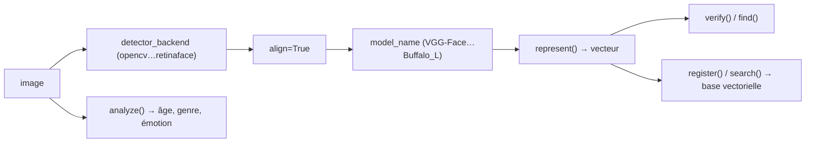

# serengil/deepface

> Reconnaissance faciale et analyse d'attributs en Python, en un appel de fonction.

## Le problème
Un pipeline de reconnaissance faciale enchaîne cinq étapes — détection, alignement, normalisation,
représentation, vérification — et chacune demande un modèle, un format et des réglages différents.

## Ce que ça fait vraiment
Une façade qui enveloppe dix modèles de reconnaissance (VGG-Face par défaut, Facenet, ArcFace,
Dlib, SFace, GhostFaceNet, Buffalo_L…) et vingt détecteurs (OpenCV par défaut, RetinaFace, MtCnn,
YuNet, plusieurs YOLO). Cinq fonctions : `verify`, `find` (base sur disque), `search` (avec
`register`, appuyé sur postgres, mongo, neo4j, pgvector, pinecone, milvus, qdrant, weaviate),
`analyze` (âge, genre, émotion, origine), `represent` (vecteurs), plus `stream` et un anti-spoofing.

## Comment c'est branché


## Essayer
```bash
pip install deepface[tensorflow]
```
```python
result = DeepFace.verify(img1_path = "img1.jpg", img2_path = "img2.jpg")
dfs = DeepFace.find(img_path = "img1.jpg", db_path = "C:/my_db")
objs = DeepFace.analyze(img_path = "img4.jpg", actions = ['age', 'gender', 'race', 'emotion'])
```

## Coût et pièges
Gratuit et local ; le README pousse aussi une API gérée (`deepface.dev`) à tarification à l'usage,
avec un endpoint MCP. Le choix du détecteur pèse lourd sur la précision : le README annonce +42 %
grâce à la détection et +6 % grâce à l'alignement, et désigne RetinaFace comme le meilleur détecteur.

## Ce que ce n'est pas
Pas une décision : `analyze` produit des estimations d'âge (±4,65 MAE annoncé), de genre et
d'« origine » — des catégories dont l'usage est réglementé et contestable. L'anti-spoofing est
désactivé par défaut (`anti_spoofing=True`). Pas une interface : le front React est un autre dépôt.

## Alternatives
- `deepface-react-ui` : dépôt séparé, si l'usage doit passer par un navigateur.
- `deepface.dev` : la version hébergée, si l'infrastructure n'est pas le sujet.

## Pour toi
La référence pour prototyper de la vision faciale ; l'usage en production est d'abord un problème juridique.
