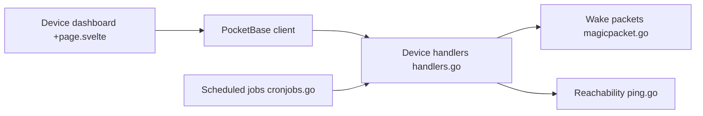

# seriousm4x/UpSnap

> Tableau de bord auto-hébergé pour réveiller par Wake-on-LAN les machines de son réseau.

## Le problème
Allumer à distance des machines locales sans retenir MAC et commandes.

## Ce que ça fait vraiment
Un bouton réveille un appareil (paquet magique), planifie des actions par cron, teste des ports, scanne le réseau (nmap) et suit les IP par ARP. Peut éteindre via une commande personnalisée. Gestion multi-utilisateurs avec droits par appareil, 35 thèmes.

## Comment c'est branché


## Essayer
```bash
sudo ./upsnap serve --http=0.0.0.0:8090
docker run --network=host seriousm4x/upsnap:latest
```

## Coût et pièges
Gratuit. Ne pas l'exposer sur Internet : la commande d'extinction est un shell potentiellement root ; le README recommande un VPN.

## Ce que ce n'est pas
Pas un outil d'administration de parc complet : uniquement allumage, extinction, ping et scan.

## Alternatives
Aucune alternative nommée dans le README.

## Pour toi
À ignorer pour l'IA : utile à un homelab, par exemple réveiller un serveur GPU à la demande, mais hors cœur de métier.

