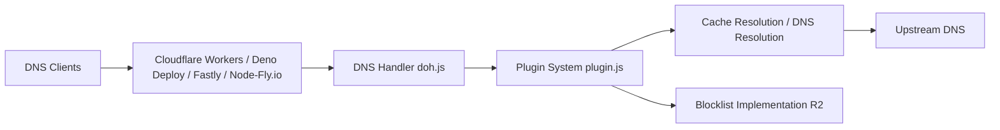

# serverless-dns/serverless-dns

> Résolveur DNS chiffré (DoH/DoT) avec blocage de contenu, déployable sur des plateformes edge.

## Le problème
Un bloqueur de publicités et traqueurs au niveau DNS type Pi-hole suppose un serveur à soi, allumé en permanence.

## Ce que ça fait vraiment
Un résolveur stub DoH et DoT qui tourne sur Cloudflare Workers, Deno Deploy, Fastly Compute@Edge ou Fly.io (Node). Il filtre les requêtes avec plus de 200 listes de blocage (environ 17 M d'entrées) compressées dans un arbre radix, téléchargées depuis Cloudflare R2. Il gère cache, authentification par jeton, TLS PSK, journaux via Logpush. Les paliers gratuits des plateformes couvrent, selon le README, 10 à 20 appareils.

## Comment c'est branché


## Essayer
```bash
git clone https://github.com/serverless-dns/serverless-dns.git
cd ./serverless-dns
npm i
./run n
```
Autres runtimes : `./run d` (Deno), `./run f` (Fastly), `./run w` (Wrangler). Déploiement Workers : `npm run build` puis `npx wrangler publish`.

## Coût et pièges
Compte chez au moins une plateforme (Cloudflare le plus simple ; Fly.io « difficile »). Les paliers gratuits peuvent être dépassés. Journaux et analytics non implémentés sur Fly et Deno Deploy. Le README signale des différences d'API entre Deno et Deno Deploy.

## Ce que ce n'est pas
Pas un résolveur récursif autonome : il s'appuie sur des DNS amont (1.1.1.2 par défaut sur Node). Ce n'est pas un outil de données : il dépend d'infrastructures tierces et des listes hébergées par le projet.

## Alternatives
- Pi-hole : auto-hébergé classique, cité comme référence du genre par le README.

## Pour toi
À ignorer pour un profil data/IA/MLOps : c'est de l'infrastructure DNS personnelle sans lien avec ton métier, et elle dépend de plateformes tierces.
