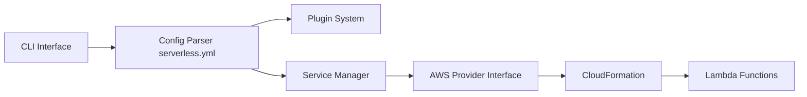

# serverless/serverless

> CLI YAML pour déployer fonctions Lambda et infrastructure AWS associée, pour développeurs cloud.

## Le problème
Déployer du code sur Lambda avec ses déclencheurs, tables et buckets à la main en CloudFormation est long et fragile.

## Ce que ça fait vraiment
Un fichier `serverless.yml` décrit un « Service » (fonctions, événements, ressources) ; la CLI le traduit en CloudFormation et déploie. V.4 ajoute un mode `dev` qui renvoie les événements Lambda vers ton code local, `diff`, Compose multi-services, TypeScript natif via ESBuild, support Bedrock AgentCore. Les fournisseurs non-AWS sont dépréciés.

## Comment c'est branché


## Essayer
```bash
npm i serverless -g
serverless
serverless deploy
serverless dev
sls remove
```

## Coût et pièges
V.4 impose une authentification dans la CLI et une nouvelle licence ; gratuit « pour les petites organisations », sinon tarification. Compte AWS et facture AWS à ta charge. Mises à jour automatiques par défaut.

## Ce que ce n'est pas
Plus un outil multi-cloud : AWS uniquement. Pas un émulateur local fidèle ; le README déconseille l'émulation complète.

## Alternatives
Aucune nommée dans le README comme concurrente (AWS SAM et CloudFormation sont pris en charge, pas proposés comme alternatives).

## Pour toi
Utile pour exposer un modèle en Lambda sur AWS ; vérifie d'abord la licence V.4 si ton organisation n'est pas « petite ».
