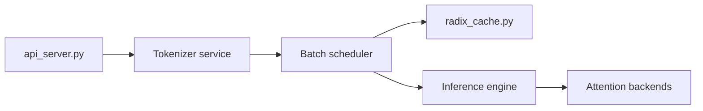

# sgl-project/mini-sglang

> Moteur d'inférence LLM compact d'environ 5 000 lignes de Python, à lire comme référence pédagogique.

## Le problème
Les moteurs de service LLM modernes sont difficiles à comprendre à cause de leur taille.

## Ce que ça fait vraiment
Serveur compatible OpenAI et shell interactif, avec radix cache pour réutiliser les préfixes, préremplissage par morceaux, ordonnancement avec recouvrement, parallélisme tensoriel, FlashAttention et FlashInfer. Modèles Llama, Mistral, Qwen2, Qwen3 et Qwen3-MoE. Un service de tokenisation séparé décharge le CPU.

## Comment c'est branché


## Essayer
```bash
git clone https://github.com/sgl-project/mini-sglang.git
cd mini-sglang && uv venv --python=3.12 && source .venv/bin/activate
uv pip install -e .
python -m minisgl --model "Qwen/Qwen3-0.6B"
```

## Coût et pièges
Linux uniquement, GPU NVIDIA, CUDA Toolkit compatible avec le pilote, noyaux compilés à la volée. WSL2 ou Docker sur Windows.

## Ce que ce n'est pas
Pas un remplaçant de SGLang en production : le README le décrit comme une version compacte et pédagogique.

## Alternatives
- SGLang : le moteur complet dont il est dérivé et avec lequel le README se compare.

## Pour toi
À surveiller : très bon pour comprendre le fonctionnement d'un serveur LLM, moins pour servir des modèles à des utilisateurs.
