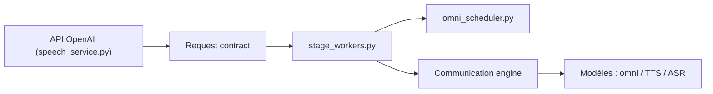

# sgl-project/sglang-omni

> Runtime de service multi-étapes pour modèles omni, parole et TTS, avec API compatible OpenAI.

## Le problème
Les modèles qui mêlent texte, audio et parole se génèrent en plusieurs étapes hétérogènes que les serveurs de LLM classiques gèrent mal.

## Ce que ça fait vraiment
Modélise la génération comme des étapes coordonnées (prétraitement, encodeurs, moteurs autorégressifs, talkers, décodeurs, vocodeurs) avec un ordonnanceur adapté à chacune, SGLang servant les étapes autorégressives. Les tenseurs circulent par mémoire partagée, NCCL, NIXL ou Mooncake. Expose chat multimodal, parole (par lot, en flux, voix téléversées) et transcription. Routeur multi-workers.

## Comment c'est branché


## Essayer
```bash
./install.sh
```
Seule commande donnée : l'installation sur macOS Apple Silicon ; le reste renvoie à la documentation.

## Coût et pièges
GPU attendu pour les modèles servis ; la liste de modèles est large (Qwen3-Omni, Fish Speech, etc.). 655 issues ouvertes : projet en mouvement.

## Ce que ce n'est pas
Pas un modèle ni une application : c'est l'infrastructure de service. Le README donne peu de détails d'usage.

## Alternatives
- SGLang : base d'exécution autorégressive que le projet compose.

## Pour toi
À surveiller : pertinent si tu sers de la parole ou de l'omni à l'échelle ; jeune (janvier 2026) et très actif, donc instable.

