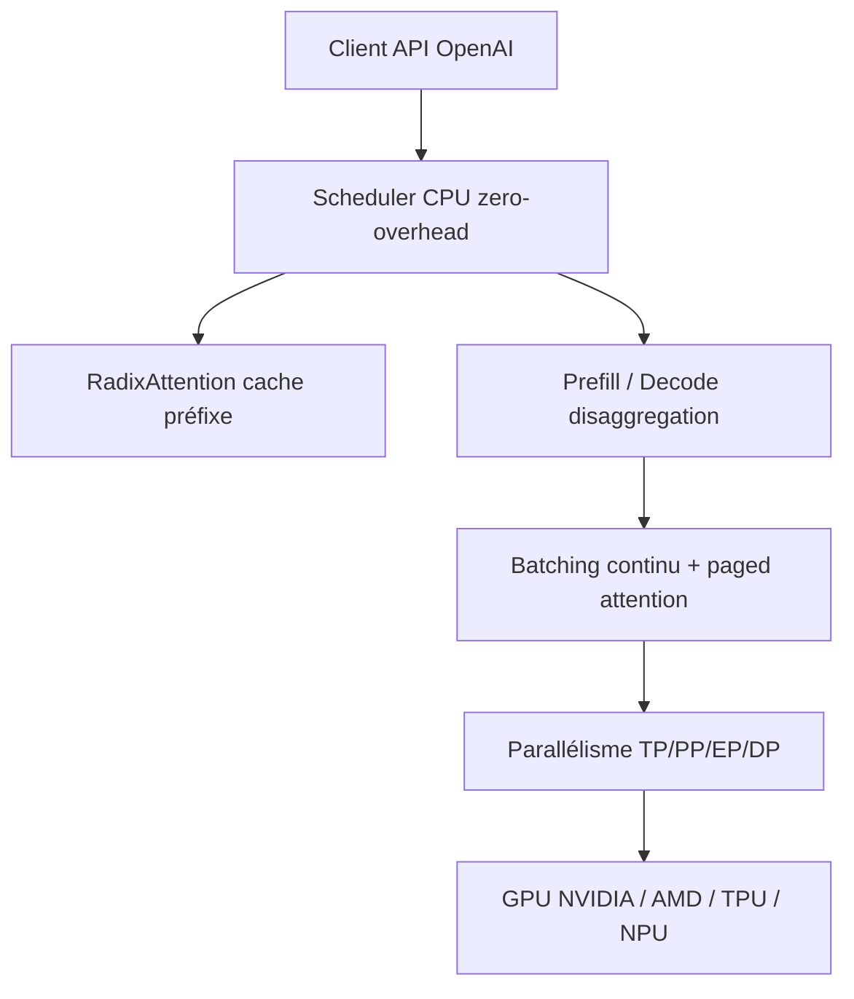

# sgl-project/sglang

> Serveur d'inférence pour LLM et modèles multimodaux, du GPU unique au cluster distribué.

## Le problème
Servir un LLM avec du batching correct, du cache de préfixe et du parallélisme demande une pile maison.
Sans ça, on paie deux fois : latence à la requête et GPU sous-utilisés en production.

## Ce que ça fait vraiment
Runtime de service : RadixAttention pour le cache de préfixe, ordonnanceur CPU sans surcoût, séparation prefill/decode, décodage spéculatif, batching continu, paged attention.
Parallélismes tensor / pipeline / expert / data, sorties structurées, prefill par morceaux, quantification FP4/FP8/INT4/AWQ/GPTQ, batching multi-LoRA.
Couvre Llama, Qwen, DeepSeek, Kimi, GLM, GPT, Gemma, Mistral, des modèles d'embedding (e5-mistral, gte, mcdse), de reward (Skywork) et de diffusion (WAN, Qwen-Image) ; API compatible OpenAI.
Matériel : GPU NVIDIA (GB200/B300/H100/A100/Spark/5090), AMD (MI355/MI300), CPU Intel Xeon, TPU Google, NPU Ascend. Sert aussi de backend de rollout pour AReaL, Miles, slime, Tunix, verl.

## Comment c'est branché

## Essayer
Aucune commande d'installation n'est écrite dans le README : il renvoie vers « Install SGLang », « Quick Start », « Backend Tutorial » et « Frontend Tutorial ». Non documenté ici.

## Coût et pièges
Logiciel gratuit, mais il faut le GPU : la facture est matérielle, pas logicielle.
Le README mentionne un contact commercial pour le déploiement à l'échelle et un sponsoring d'agents de code pour les contributeurs réguliers.

## Ce que ce n'est pas
Ce n'est pas un framework d'entraînement : c'est un moteur de service, utilisé comme backend de rollout par des frameworks de post-training tiers.
Ce n'est pas une solution sans GPU ni un service hébergé : vous opérez le serveur.
Le README reconnaît reprendre des idées et du code de Guidance, vLLM, LightLLM, FlashInfer, Outlines et LMQL.

## Alternatives
- vLLM — cité comme source d'inspiration ; même créneau de service, écosystème plus ancien.
- LightLLM — autre runtime de service léger, nommé dans les remerciements.
- FlashInfer — brique d'attention, à préférer si vous construisez votre propre moteur.

## Pour toi
À adopter dès que tu sers un LLM en interne : c'est le socle d'inférence le plus outillé de la liste.
