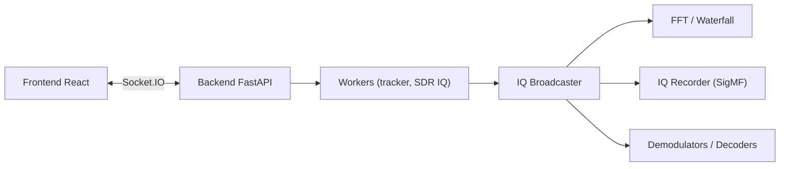

# sgoudelis/ground-station

> Application web pour suivre des satellites, piloter antennes et radios SDR, et décoder leurs signaux.

## Le problème
Suivre un passage de satellite, pointer un rotor, corriger le Doppler, enregistrer et décoder le signal oblige à assembler plusieurs outils radio séparés.

## Ce que ça fait vraiment
Un backend FastAPI + Socket.IO orchestre des processus workers : suivi d'orbite (Skyfield/SGP4), acquisition IQ depuis RTL-SDR, SoapySDR ou UHD, FFT/waterfall, démodulation, enregistrement SigMF et décodeurs (SSTV, APRS, GMSK…). Un ordonnanceur APScheduler lance des observations automatiques. L'interface est en React/Redux/MUI. Certains décodeurs sont marqués en cours de développement dans le README.

## Comment c'est branché


## Essayer
```bash
docker pull ghcr.io/sgoudelis/ground-station:<version>
docker run -d --platform linux/amd64 -p 7000:7000 --name ground-station \
  --restart unless-stopped --device=/dev/bus/usb --privileged \
  -v /path/to/data:/app/backend/data \
  ghcr.io/sgoudelis/ground-station:<version>
```

## Coût et pièges
Gratuit, mais demande du matériel radio (SDR, rotor) et un accès USB en mode `--privileged`. L'image embarque l'API SDRplay propriétaire, dont l'EULA est à accepter. Usage prévu sur réseau privé de confiance.

## Ce que ce n'est pas
Pas un outil de data science ni d'IA. Le README indique un développement assisté par agents LLM.

## Alternatives
- SatDump : décodage d'images satellites, utilisé ici en option.
- gr-satellites : modules GNU Radio de décodage, utilisés ici en dépendance.

## Pour toi
À ignorer pour un profil data/IA/MLOps : c'est un outil de radioamateur sans lien avec ton périmètre, et il repose sur du matériel dédié.
