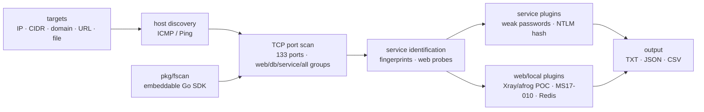

# shadow1ng/fscan

> **All-in-one internal-network scanner on the command line, for authorized penetration testing.**

## The problem

Mapping an internal network during a penetration test means chaining host discovery, port
scanning, service identification, weak-password testing and known-vulnerability detection by
hand, each with a different tool that you must stitch together yourself. On a large B or C
segment, the time spent orchestrating those tools outweighs the time spent analyzing results.

## What it actually does

Fscan chains those steps into a single command. The README lists: host discovery (ICMP/Ping),
full-connect TCP scanning over 133 default ports with named groups (web/db/service/all),
fingerprint-based service identification (20+ services), and web probes (title, CMS, WAF/CDN,
40+ fingerprints). Next comes weak-password testing across 28 services (SSH, RDP, SMB, FTP,
MySQL, MSSQL, Oracle, Redis…), NTLM hash collision and SSH key authentication. On the
vulnerability side: MS17-010, SMBGhost (CVE-2020-0796), unauthenticated access (Redis, MongoDB,
Memcached, Elasticsearch), and a POC engine in Xray and afrog format. The README also describes
exploitation modules (Redis: write public key, cron task, WebShell) and local modules (info
gathering, persistence, reverse shell) — beyond plain scanning. A Go SDK (`pkg/fscan`) lets you
embed the engine.

## How it's wired



No code-derived diagram exists for this repository: this schema is reconstructed from the README
alone. It shows the single pipeline — targets, discovery, ports, services — from which the
separate plugins (service, web, local) branch off, all converging on a multi-format output.

## Trying it

```bash
# Standard build
go build -ldflags="-s -w" -trimpath -o fscan .

# With web management interface
go build -tags web -ldflags="-s -w" -trimpath -o fscan-web .

# Scan a C segment
./fscan -h 192.168.1.1/24

# Specific ports
./fscan -h 192.168.1.1 -p 22,80,443,3389

# Web scan
./fscan -u http://192.168.1.1

# Redis: write public key
./fscan -h 192.168.1.1 -m redis -rf id_rsa.pub
```

On Arch Linux the README also offers `yay -S fscan-git`.

## Cost and traps

- **Free and with no external dependency** at runtime: a standalone binary, no API key or
  third-party service to wire in.
- **You need the Go toolchain to compile**: the README ships no prebuilt binary, only `go build`
  (and `yay -S fscan-git` on Arch). That is the real cost of entry.
- **Dual-use tool**: the README states it plainly — use is restricted to **legally authorized**
  security work, and the author disclaims responsibility for illegal use. Scanning without
  authorization is a legal exposure.
- **Active offensive modules**: beyond scanning, fscan writes WebShells, injects shellcode
  (MS17-010) and installs persistence. Running it "just to see" on a production network can
  modify targets, not merely inspect them.
- **DNSLog**: DNS-exfiltration detection assumes a reachable DNSLog server to receive callbacks.

## What it is not

- **It is not an application vulnerability scanner (SCA/SAST)**: it does not read source code or
  a project's dependencies; it probes live hosts and services on the network.
- **It is not a defensive or compliance scanner**: it is an offensive reconnaissance and
  exploitation tool, not a posture audit.
- **It is not ready for unsupervised use**: the exploitation modules alter targets; running it
  without an authorized scope is not neutral.
- **The C-based fscan-lite and the fscan-lab range are announced as unfinished** in the README.

## Alternatives

| | When to prefer it |
|---|---|
| **aquasecurity/trivy** | Catalogue neighbor, different domain: it scans images, filesystems and dependencies for CVEs and secrets. Prefer it to secure a build chain or a container, not to recon an internal network. |
| **google/osv-scanner** | Catalogue neighbor: a dependency vulnerability scanner via the OSV database. It answers "do my packages have CVEs?", not "what is on this network segment?". |
| **OWASP/Nettacker · future-architect/vuls** | Lexicon-suggested neighbors: Nettacker automates network reconnaissance (the closest), vuls does agent-based vulnerability management on known hosts. Neither covers the same scan → brute-force → exploitation chain as fscan; the README names neither. |

## For you

Watch rather than adopt for a data / AI / MLOps profile: this is not a daily-driver tool unless
you run authorized offensive security work. The one point of interest is the Go SDK `pkg/fscan`,
presented as embeddable in an agent with task control (Pause/Resume), progress callbacks and
TaskID tracing — relevant if you build a security platform that must drive scans
programmatically. Outside that case, and outside a legally authorized scope, move on: the tool is
potent against live targets, hence dangerous when misused.
