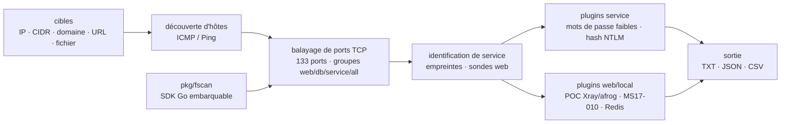

# shadow1ng/fscan

> **Scanner tout-en-un de réseau interne en ligne de commande, pour un test d'intrusion autorisé.**

## Le problème

Cartographier un réseau interne pendant un test d'intrusion, c'est enchaîner à la main la
découverte d'hôtes, le balayage de ports, l'identification des services, le test de mots de
passe faibles et la détection de failles connues — chaque étape avec un outil différent, à
recoller soi-même. Sur un grand segment B ou C, le temps passé à orchestrer ces outils dépasse
le temps d'analyse.

## Ce que ça fait vraiment

Fscan enchaîne ces étapes en une seule commande. Le README annonce : découverte d'hôtes
(ICMP/Ping), balayage TCP en connexion complète sur 133 ports par défaut avec des groupes
nommés (web/db/service/all), identification de service par empreintes (20+ services), sondes
web (titre, CMS, WAF/CDN, 40+ empreintes). Vient ensuite le test de mots de passe faibles sur
28 services (SSH, RDP, SMB, FTP, MySQL, MSSQL, Oracle, Redis…), la collision de hash NTLM et
l'authentification par clé SSH. Côté failles : MS17-010, SMBGhost (CVE-2020-0796), accès non
authentifié (Redis, MongoDB, Memcached, Elasticsearch), et un moteur de POC au format Xray et
afrog. Le README décrit aussi des modules d'exploitation (Redis : écriture de clé publique, de
tâche planifiée, de WebShell) et des modules locaux (collecte d'infos, persistance, shell
inverse) — au-delà du simple scan. Un SDK Go (`pkg/fscan`) permet d'embarquer le moteur.

## Comment c'est branché



Aucun diagramme tiré du code n'existe pour ce dépôt : ce schéma est reconstruit depuis le seul
README. Il montre le pipeline unique — cibles, découverte, ports, services — d'où partent les
plugins (service, web, local) séparés par l'architecture décrite, tous convergeant vers une
sortie multi-format.

## Essayer

```bash
# Compilation standard
go build -ldflags="-s -w" -trimpath -o fscan .

# Avec interface web de gestion
go build -tags web -ldflags="-s -w" -trimpath -o fscan-web .

# Scanner un segment C
./fscan -h 192.168.1.1/24

# Ports précis
./fscan -h 192.168.1.1 -p 22,80,443,3389

# Scan web
./fscan -u http://192.168.1.1

# Redis : écriture de clé publique
./fscan -h 192.168.1.1 -m redis -rf id_rsa.pub
```

Sous Arch Linux, le README donne aussi `yay -S fscan-git`.

## Coût et pièges

- **Gratuit et sans dépendance externe** au moment de l'exécution : un binaire autonome, pas de
  clé d'API ni de service tiers à câbler.
- **Il faut la chaîne Go pour compiler** : le README ne fournit pas de binaire pré-compilé, seulement
  `go build` (et `yay -S fscan-git` sur Arch). C'est le vrai coût d'entrée.
- **Outil à double usage** : le README le rappelle en toutes lettres — usage réservé aux
  **actions de sécurité légalement autorisées**, l'auteur décline toute responsabilité pour un
  usage illégal. Scanner sans autorisation expose juridiquement.
- **Modules offensifs actifs** : au-delà du scan, fscan écrit des WebShells, injecte du
  shellcode (MS17-010), pose de la persistance. Le lancer « pour voir » sur un réseau de
  production peut modifier les cibles, pas seulement les ausculter.
- **DNSLog** : la détection par exfiltration DNS suppose un serveur DNSLog joignable pour
  recevoir les rappels.

## Ce que ce n'est pas

- **Ce n'est pas un scanner de vulnérabilités applicatives type SCA/SAST** : il ne lit pas le
  code source ni les dépendances d'un projet, il sonde des hôtes et services vivants sur le réseau.
- **Ce n'est pas un outil défensif ni un scanner de conformité** : c'est un outil offensif de
  reconnaissance et d'exploitation, pas un audit de posture.
- **Ce n'est pas prêt pour un usage non supervisé** : les modules d'exploitation altèrent les
  cibles ; le lancer sans périmètre autorisé n'est pas neutre.
- **Le fscan-lite en C et le fscan-lab (靶場) sont annoncés comme non finis** dans le README.

## Alternatives

| | Quand le préférer |
|---|---|
| **aquasecurity/trivy** | Voisin du catalogue, mais domaine différent : il scanne images, systèmes de fichiers et dépendances à la recherche de CVE et de secrets. À préférer pour sécuriser une chaîne de build ou un conteneur, pas pour reconnaître un réseau interne. |
| **google/osv-scanner** | Voisin du catalogue : scanner de vulnérabilités des dépendances via la base OSV. Répond à « mes paquets ont-ils des CVE ? », pas à « qu'y a-t-il sur ce segment réseau ? ». |
| **OWASP/Nettacker · future-architect/vuls** | Voisins proposés par le lexique : Nettacker automatise de la reconnaissance réseau (le plus proche), vuls fait de la gestion de vulnérabilités par agent sur des hôtes connus. Aucun ne couvre le même enchaînement scan → brute-force → exploitation que fscan ; le README ne les nomme pas. |

## Pour toi

À surveiller plutôt qu'à adopter pour un profil data / IA / MLOps : ce n'est pas un outil de ton
quotidien, sauf mission de sécurité offensive autorisée. Le point qui peut intéresser est le SDK
Go `pkg/fscan`, présenté comme embarquable dans un agent avec contrôle de tâche (Pause/Resume),
rappels de progression et suivi par TaskID — si tu construis une plateforme de sécurité qui doit
piloter des scans par programme. Hors de ce cas, et hors périmètre légalement autorisé, passe ton
chemin : l'outil est puissant sur des cibles vivantes, donc dangereux mal employé.
