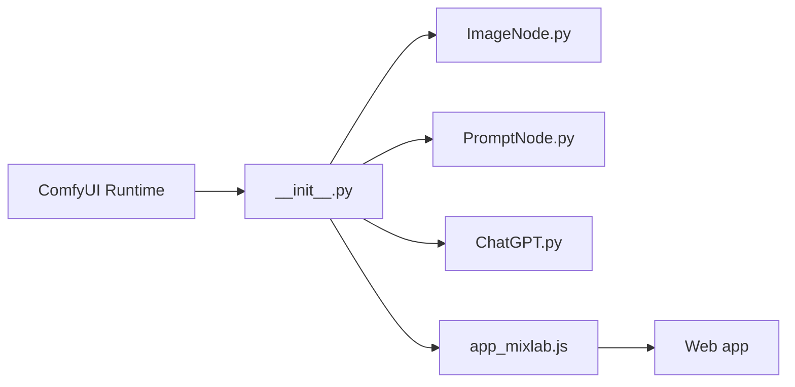

# shadowcz007/comfyui-mixlab-nodes

> Gros pack de nœuds ComfyUI pour images, prompts, 3D, LLM, audio, et publication de workflows en web apps.

## Le problème
Construire des workflows créatifs ComfyUI exige beaucoup de nœuds dispersés, et partager un workflow comme application est pénible.

## Ce que ça fait vraiment
Nœuds d'image (calques, masques, suppression d'arrière-plan rembg), prompts (aléatoire, chinois, ClipInterrogator), LLM (OpenAI-compatible, Siliconflow, local), audio, TripoSR en 3D, partage d'écran, vidéo via fal.ai. Le nœud AppInfo transforme un workflow en web app avec entrées et sorties limitées à quelques types de nœuds.

## Comment c'est branché


## Essayer
```bash
cd ComfyUI/custom_nodes
git clone https://github.com/shadowcz007/comfyui-mixlab-nodes.git
cd comfyui-mixlab-nodes
pip3 install -r requirements.txt
```

## Coût et pièges
Modèles à télécharger à la main (TripoSR, rembg, lama…). APIs tierces à ta charge. Le README, mélange de changelogs chinois et anglais, date d'une ancienne combinaison torch 2.3.1. Le modèle briarmbg est non commercial. 224 issues ouvertes.

## Ce que ce n'est pas
Pas un seul outil cohérent : un fourre-tout de nœuds, dont certains non maintenus.

## Alternatives
Aucune alternative nommée dans le README (plugins connexes comme comfyui-liveportrait).

## Pour toi
À ignorer pour du MLOps : utile seulement aux utilisateurs ComfyUI créatifs, et l'ensemble est lourd et peu documenté.

