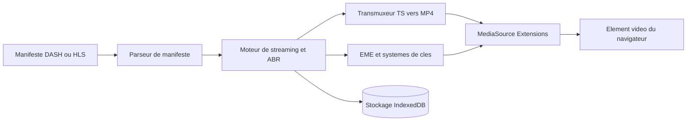

# shaka-project/shaka-player

> **A JavaScript library that plays DASH and HLS adaptive streams in browsers, no plugins.**

## The problem

Playing adaptive-bitrate video in a browser means parsing a DASH or HLS manifest, feeding MediaSource
segment by segment, negotiating codecs per platform, and handling DRM through EME. Written by hand,
that work is redone for every browser, every connected TV and every key system — and the README notes
Safari/iOS additionally forces a separate native playback path.

## What it actually does

It parses DASH manifests (VOD, Live, in-progress recordings, multi-period, xlink, every form of segment
index) and HLS playlists (VOD, Live, Event, low latency with partial segments and delta playlists). It
pushes segments into MediaSource, transmuxes when needed (raw or MPEG-2 TS AAC, MP3, AC-3, EC-3 into
MP4; H.264 and H.265 from TS into MP4), renders WebVTT, TTML and CEA-608/708 captions, and negotiates
DRM via EME with Widevine, PlayReady, FairPlay, WisePlay and ClearKey. It also stores content offline in
IndexedDB, exposes DASH/HLS thumbnails, supports equirectangular and cubemap VR, and plugs ads in
through IMA or AWS MediaTailor. Several builds ship: full with UI, without UI, DASH-only, HLS-only, and
an experimental one carrying the MOQT/MSF module.

## How it is wired

The manifest is read by a parser — replaceable through a manifest parser plugin, per the README — which
feeds the streaming engine. That engine picks variants, transmuxes containers the browser cannot ingest,
and fills MediaSource, while EME negotiates licences with the key system. Offline mode diverts the same
stream into IndexedDB. On iOS before iPadOS 13 the README says this path is bypassed entirely: Shaka just
sets the video element's `src` and defers to Apple's native HLS player.

## Trying it

The README documents **no install or build command**. It points to hosted builds (Google Hosted Libraries,
jsDelivr for the npm package `shaka-player`), a demo, a nightly demo, API docs and tutorials. Nothing can
be copied here without inventing it.

## Cost and traps

The code is free and aims to have no third-party dependencies, but the cost sits elsewhere. DRM relies on
pieces you do not control: only official Chrome builds carry the Widevine CDM (Chromium built from source
has no DRM), Firefox prompts the user to enable DRM, PlayReady on Edge does not work in a VM or over
Remote Desktop, and FairPlay is confined to Safari on macOS and iOS. ClearKey, the README states, is a
debugging tool with no real content security. Monetization goes through third-party SDKs and services
(IMA, IMA DAI, AWS MediaTailor). LCEVC and the HEVC software fallback require separate npm packages
(`lcevc_dec.js`, `@hevcjs/shaka-plugin`). And a large slice of the platform matrix — WebOS, Hisense, Vizio,
PlayStation, Titan OS, TiVo OS — is marked community-supported and untested by the team.

## What it is not

Not an encoder, packager or server: it plays streams someone else produced. Not a universal player — the
README lists the unsupported cases explicitly (xlink actuate=onRequest, manifests with no segment info,
timescales beyond 2^53, VOD over MOQT, X-SNAP in interstitials). Not a React/Vue/Angular component either:
the team writes it lacks the bandwidth and experience to support framework integrations and links to
community projects instead. And it does not free you from the browser: nearly everything depends on the
target platform's MediaSource, WebCodecs or Web Crypto support.

## Alternatives

No competing player is named in the README and no catalogue neighbours were provided, so there is no
comparable alternative in the catalogue. The README only lists integrations, not substitutes:
`winoffrg/limeplay` and `matvp91/shaka-player-react` for React, `davidjamesherzog/videojs-shaka` as a
bridge to video.js — worth a look if you want Shaka wrapped rather than a different engine.

## For you

Little overlap with day-to-day data/AI work, unless you are building a playback front end on top of a
media pipeline: then this is the brick to take rather than rewrite, maintained by Ateme, Google and
Paramount. Otherwise, skip it without regret.
