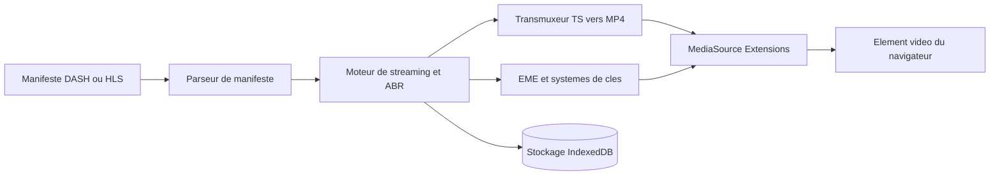

# shaka-project/shaka-player

> **Lecteur JavaScript de flux adaptatifs DASH et HLS pour développeurs web, sans plugin ni Flash.**

## Le problème

Lire un flux vidéo à débit adaptatif dans un navigateur suppose de parser un manifeste DASH ou HLS,
d'alimenter MediaSource segment par segment, de négocier les codecs selon la plateforme et de gérer
le DRM via EME. Fait à la main, cela se réécrit pour chaque navigateur, chaque TV connectée et chaque
système de clés — et le README rappelle que Safari/iOS impose en plus un chemin natif distinct.

## Ce que ça fait vraiment

La bibliothèque parse les manifestes DASH (VOD, Live, enregistrement en cours, multi-period, xlink,
toutes les formes de segment index) et HLS (VOD, Live, Event, basse latence avec segments partiels et
playlists delta). Elle pousse les segments dans MediaSource, transmuxe au besoin (AAC, MP3, AC-3, EC-3
bruts ou en MPEG-2 TS vers MP4, H.264 et H.265 en TS vers MP4), gère les sous-titres WebVTT, TTML et
les captions CEA-608/708, et négocie le DRM par EME avec Widevine, PlayReady, FairPlay, WisePlay et
ClearKey. Elle sait aussi stocker des contenus hors ligne dans IndexedDB, exposer des vignettes DASH/HLS,
faire de la VR équirectangulaire ou cubemap, et brancher de la publicité via IMA ou AWS MediaTailor.
Elle se décline en plusieurs builds : complet avec UI, sans UI, DASH seul, HLS seul, et une build
expérimentale contenant le module MOQT/MSF.

## Comment c'est branché

Le manifeste est lu par un parseur — remplaçable par un *manifest parser plugin* d'après le README —
qui alimente le moteur de streaming. Celui-ci choisit les variantes, transmuxe les conteneurs non
supportés nativement, et alimente MediaSource ; en parallèle, EME négocie les licences auprès du
système de clés. Le mode hors ligne dérive le même flux vers IndexedDB. Sur iOS avant iPadOS 13, le
README précise que ce chemin est court-circuité : Shaka pose simplement le `src` du `<video>` et
délègue au lecteur HLS natif d'Apple.

## Essayer

Le README ne documente **aucune commande** d'installation ou de build. Il renvoie vers des builds
hébergées (Google Hosted Libraries, jsDelivr pour le paquet npm `shaka-player`), une démo, une démo
nightly, la documentation d'API et des tutoriels. Rien n'est recopiable ici sans l'inventer.

## Coût et pièges

Le code est gratuit et se veut sans dépendance tierce, mais le coût est ailleurs. Le DRM dépend de
briques que tu ne contrôles pas : seuls les builds officiels de Chrome embarquent le CDM Widevine
(Chromium compilé depuis les sources ne fait pas de DRM), Firefox demande à l'utilisateur d'activer
le DRM, PlayReady sur Edge ne fonctionne pas en VM ni en bureau à distance, et FairPlay est limité à
Safari macOS/iOS. ClearKey, précise le README, sert au débogage et n'apporte aucune sécurité réelle.
La monétisation passe par des SDK et services tiers (IMA, IMA DAI, AWS MediaTailor). LCEVC et le
repli logiciel HEVC exigent des paquets npm séparés (`lcevc_dec.js`, `@hevcjs/shaka-plugin`). Enfin,
une large partie de la matrice de plateformes (WebOS, Hisense, Vizio, PlayStation, Titan OS, TiVo OS)
est marquée « community-supported and untested by us ».

## Ce que ce n'est pas

Ce n'est pas un encodeur, un packager ni un serveur : il lit des flux déjà produits, il ne les
fabrique pas. Ce n'est pas un lecteur universel — le README liste explicitement les non-supportés
(xlink actuate=onRequest, manifestes sans info de segment, timescales dépassant 2^53, VOD en MOQT,
X-SNAP dans les interstitiels). Ce n'est pas non plus un composant React/Vue/Angular : l'équipe écrit
qu'elle n'a ni la bande passante ni l'expérience pour supporter les intégrations de frameworks, et
renvoie vers des projets communautaires. Et il n'affranchit pas du navigateur : presque tout dépend du
support MediaSource, WebCodecs ou Web Crypto de la plateforme cible.

## Alternatives

Aucun lecteur concurrent n'est nommé dans le README et aucun voisin de catalogue n'est fourni, donc
aucune alternative comparable dans le catalogue. Le README ne cite que des intégrations, pas des
substituts : `winoffrg/limeplay` et `matvp91/shaka-player-react` pour React, `davidjamesherzog/videojs-shaka`
pour un pont vers video.js — à regarder si tu veux du Shaka enrobé plutôt qu'un autre moteur.

## Pour toi

Peu de recouvrement avec un quotidien data/IA, sauf si tu construis une interface de lecture au-dessus
d'un pipeline média : c'est alors la brique à prendre plutôt qu'à réécrire, maintenue par Ateme, Google
et Paramount. Sinon, à ignorer sans remords.
