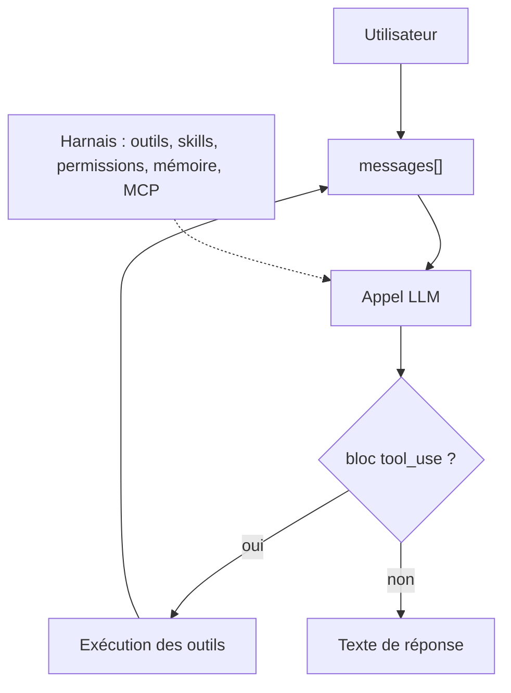

# shareAI-lab/learn-claude-code

> Cours en dix-sept chapitres exécutables sur la construction d'un harnais d'agent, à partir de zéro.

## Le problème
« Construire un agent » est confondu avec enchaîner des appels d'API dans un graphe de nœuds.
Personne n'explique ce que fait réellement le code autour de la boucle : outils, contexte, permissions, mémoire.

## Ce que ça fait vraiment
Pose une thèse nette : l'agentivité vient de l'entraînement du modèle, pas du code ; ton travail est le harnais.
Dix-sept chapitres, un mécanisme chacun, autour d'une boucle `while True` de vingt lignes reproduite dans le README.
Chaque dossier contient un README en trois langues, un `code.py` exécutable et des diagrammes SVG.
Progression : boucle, outils, permissions, hooks, todo, sous-agents, skills, compaction, mémoire, tâches,
arrière-plan, cron, équipes, MCP, harnais intégré, runtime de workflow, boucle de but.

## Comment c'est branché


## Essayer
```sh
git clone https://github.com/shareAI-lab/learn-claude-code
cd learn-claude-code
pip install -r requirements.txt
python s01_agent_loop/code.py
```

## Coût et pièges
Le cours est gratuit ; exécuter les chapitres consomme une clé `ANTHROPIC_API_KEY` à ta charge.
Deux pistes coexistent (racine `s01-s17` et `docs/`+`agents/` hérités) : ne pas mélanger les numéros de chapitre.

## Ce que ce n'est pas
Pas une bibliothèque : rien à importer, ce sont des implémentations pédagogiques autonomes.
Pas neutre — le dépôt promeut en fin de parcours deux produits maison, Kode CLI et Kode Agent SDK.
Le README ne déclare aucune licence.

## Alternatives
- `affaan-m/ECC` : l'inverse, un harnais tout fait plutôt qu'une explication de sa construction.
- `Snailclimb/JavaGuide` : même format de cours en dépôt, sur un tout autre sujet.

## Pour toi
La meilleure ressource du lot pour comprendre ce qu'on installe quand on installe un agent. À lire.
